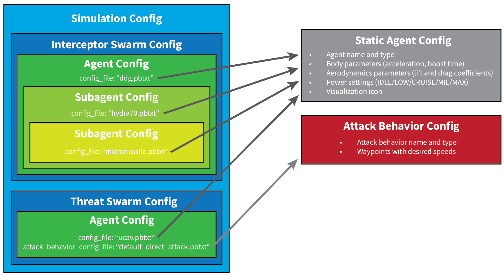

# Simulation Configuration Guide

In this guide, we will explore the different types of configuration files used in the simulation and how to modify them to customize your simulation scenarios.

## Introduction

{width=90%}

You can customize interceptor and threat behaviors, simulation parameters, and more to suit your needs.
There are three main types of configuration files:

1. **Simulation Configurations** define the overall setup of the simulation, including agents, their quantities, initial states, and behaviors.
2. **Static Agent Configurations (Agent Models)** define the physical and performance characteristics of individual agent types (e.g., mass, acceleration, aerodynamic properties).
3. **Attack Behavior Configurations** define the behavior of threat agents during the simulation (e.g., movement patterns, attack strategies).

Understanding these configurations will enable you to set up complex simulations that meet your specific requirements.

> [!WARNING]
> Always back up configuration files before making significant changes.
> Incorrect configurations can lead to simulation errors.

## Configuration Files

The main configuration files you will work with are located in the `Assets/StreamingAssets/Configs/` directory.
All configuration files are written in Protobuf text format and correspond to the proto messages defined in the `Assets/Proto/Configs/` directory.

> [!NOTE]
> In a deployment context (i.e., you downloaded the binary release from the [releases page](https://github.com/PisterLab/micromissiles-unity/releases)), these files are located in the `micromissiles_Data/StreamingAssets/Configs/` directory.
>
> On Windows and Linux, this directory is located alongside the executable.
>
> On MacOS, you need to right-click the `micromissiles-v*.*` Application > `Show Package Contents` > `Contents/Resources/Data/StreamingAssets/Configs/`.

Several example configuration files are provided to help you get started.

```bash
Configs/
├── Simulations/
│   ├── 7_quadcopters.pbtxt                  # Seven incoming quadcopter drones
│   ├── 7_ucav.pbtxt                         # Seven incoming combat drones
│   ├── 7_brahmos.pbtxt                      # Seven incoming supersonic cruise missiles
│   ├── 5_swarms_7_quadcopters.pbtxt         # Five incoming swarms of seven incoming quadcopter drones each
│   ├── 5_swarms_7_ucav.pbtxt                # Five incoming swarms of seven incoming combat drones each
│   ├── 5_swarms_7_brahmos.pbtxt             # Five incoming swarms of seven incoming supersonic cruise missiles each
│   ├── 5_swarms_100_ucav.pbtxt              # 100 incoming combat drones stacked into five swarms
│   ├── 5_swarms_500_ucav.pbtxt              # 500 incoming combat drones stacked into five swarms
│   └── 7_quadcopters_15_ucav.pbtxt          # Seven quadcopters followed by 15 combat drones
│
├── Models/
│   ├── Interceptors
│   │  ├── hydra70.pbtxt                     # Carrier rocket
│   │  ├── micromissile.pbtxt                # Main micromissile interceptor
│   │  └── sfrj.pbtxt                        # Solid fuel ramjet carrier missile
│   │
│   └── Threats
│      ├── ascm.pbtxt                        # Anti-ship cruise missile
│      ├── brahmos.pbtxt                     # Supersonic cruise missile
│      ├── fateh110b.pbtxt                   # Tactical ballistic missile
│      ├── quadcopter.pbtxt                  # Simple quadcopter drone
│      └── ucav.pbtxt                        # Simple fixed-wing combat drone
│
└── Attacks/
    ├── default_direct_attack.pbtxt          # Standard attack profile
    ├── brahmos_direct_attack.pbtxt          # Cruise missile profile
    └── fateh110b_direct_attack.pbtxt        # Ballistic missile profile
```

### File Locations

Development context:
- **Simulation Configurations**: `Assets/StreamingAssets/Configs/Simulations/`
- **Model Configurations**: `Assets/StreamingAssets/Configs/Models/`
- **Attack Behaviors**: `Assets/StreamingAssets/Configs/Attacks/`

Deployment context:
- **Simulation Configurations**: `micromissiles_Data/StreamingAssets/Configs/Simulations/`
- **Model Configurations**: `micromissiles_Data/StreamingAssets/Configs/Models/`
- **Attack Behaviors**: `micromissiles_Data/StreamingAssets/Configs/Attacks/`

## Simulation Configurations

These files dictate how the simulation initializes and runs.
They specify the agents involved, their initial conditions, and their behaviors.

> [!IMPORTANT]
> While the simulation is running, you can load a new simulation configuration at runtime by opening the panel with `L`.
>
> The simulator will detect any new or updated files in the `StreamingAssets/Configs/Simulations/` directory and present them in the dropdown menu.

### Structure

A simulation configuration file is structured as follows:

- **`end_time`**: Specifies when the simulation should end.
- **`time_scale`**: Adjusts the speed of the simulation.
- **`interceptor_swarm_configs`**: A list of interceptor swarms with their configurations.
- **`threat_swarm_configs`**: A list of threat swarms with their configurations.

Each swarm configuration includes:

- **`num_agents`** (for threats): Number of agents in the swarm.
- **`agent_config`**: Agent configuration, including:
  - **`config_file`**: Reference to a static agent configuration file.
  - **`attack_behavior_config_file`** (for threats): Reference to an attack behavior configuration file.
  - **`initial_state`** (for threats): Starting position, rotation, and velocity.
  - **`standard_deviation`** (for threats): Variability in initial states.
  - **`dynamic_config`**: Time-dependent settings (sensor configurations, flight configurations).
  - **`sub_agent_config`** (for interceptors): Configuration for any submunitions deployed.
    - **`num_sub_agents`**: Number of submunitions that each interceptor in the swarm will release.
    - **`agent_config`**: Submunition agent configuration.

An advantage of using Protobuf messages to define the simulation configuration is that recursive message definitions are allowed.
As a result, it is possible to represent arbitrarily deep hierarchies of submunitions in the simulation configuration.

Note that the number of agents in the swarm, the initial states, and the launch times are not specified for interceptor swarms.
The IADS will automatically determine how many interceptors to launch and when to launch them against the incoming threats by [clustering](./Simulator_Overview.md#clustering) them.
The carrier interceptors will then independently determine [when to release the submunitions](./Simulator_Overview.md#submunitions-release).

### Examples

The simulation configurations are defined in Protobuf text format files that specify the initial setup for missiles and targets.

#### Example 1: `7_quadcopters.pbtxt`

A simple simulation with one interceptor type (Hydra 70) launched against seven quadcopter threats.

```textproto
end_time: 300
time_scale: 1
interceptor_swarm_configs {
  agent_config {
    config_file: "hydra70.pbtxt"
    dynamic_config {
      flight_config {
        controller_type: PROPORTIONAL_NAVIGATION
      }
      sensor_config {
        type: IDEAL
        frequency: 100
      }
    }
    sub_agent_config {
      num_sub_agents: 7
      agent_config: {
        config_file: "micromissile.pbtxt"
        dynamic_config {
          flight_config {
            controller_type: PROPORTIONAL_NAVIGATION
          }
          sensor_config {
            type: IDEAL
            frequency: 100
          }
        }
      }
    }
  }
}
threat_swarm_configs {
  num_agents: 7
  agent_config {
    config_file: "quadcopter.pbtxt"
    attack_behavior_config_file: "default_direct_attack.pbtxt"
    initial_state {
      position {
        x: 0
        y: 800
        z: 6000
      }
      velocity {
        x: 0
        y: 0
        z: -50
      }
    }
    standard_deviation {
      position {
        x: 1000
        y: 200
        z: 100
      }
      velocity {
        x: 0
        y: 0
        z: 25
      }
    }
    dynamic_config {
      flight_config {
        evasion_config {
            enabled: true
            range_threshold: 1000
        }
      }
      sensor_config {
        type: IDEAL
        frequency: 100
      }
    }
  }
}
```

**Core Settings:**
- `end_time: 300` - Sets a 5 minute simulation duration.
- `time_scale: 1` - Runs in real time (increase for faster simulation).

**Interceptor Configurations (`interceptor_swarm_configs`):**
- Deploys Hydra 70 rockets with:
  - Controller settings: Uses proportional navigation to steer the rocket.
  - Sensor settings: Uses an ideal sensor with an update frequency of 100 Hz.
  - Sub-agent capability: Releases 7 micromissiles per Hydra 70 rocket.

**Threat Configurations (`threat_swarm_configs`):**
- Deploys 7 quadcopter drones with:
  - Uses the quadcopter model.
  - Follows the direct attack behavior defined in `default_direct_attack.pbtxt`.
  - Initial positions/velocities are randomly perturbed.
  - Enables interceptor evasion starting from a range threshold of 1 km.

#### Example 2: `5_swarms_7_brahmos.pbtxt`

A complex scenario that involves multiple swarms of supersonic cruise missiles that are spaced 5 km apart.
This scenario demonstrates how the IADS will stagger the interceptor launch times to defeat the layered threat swarms.

```textproto
end_time: 300
time_scale: 1
interceptor_swarm_configs {
  agent_config {
    config_file: "hydra70.pbtxt"
    dynamic_config {
      flight_config {
        controller_type: PROPORTIONAL_NAVIGATION
      }
      sensor_config {
        type: IDEAL
        frequency: 100
      }
    }
    sub_agent_config {
      num_sub_agents: 7
      agent_config: {
        config_file: "micromissile.pbtxt"
        dynamic_config {
          flight_config {
            controller_type: PROPORTIONAL_NAVIGATION
          }
          sensor_config {
            type: IDEAL
            frequency: 100
          }
        }
      }
    }
  }
}
threat_swarm_configs {
  num_agents: 7
  agent_config {
    config_file: "brahmos.pbtxt"
    attack_behavior_config_file: "brahmos_direct_attack.pbtxt"
    initial_state {
      position {
        x: 0
        y: 50
        z: 30000
      }
      velocity {
        x: 0
        y: 0
        z: -800
      }
    }
    standard_deviation {
      position {
        x: 3000
        y: 10
        z: 200
      }
      velocity {
        x: 0
        y: 0
        z: 25
      }
    }
    dynamic_config {
      flight_config {
        evasion_config {
            enabled: true
            range_threshold: 2000
        }
      }
      sensor_config {
        type: IDEAL
        frequency: 100
      }
    }
  }
}
threat_swarm_configs {
  num_agents: 7
  agent_config {
    config_file: "brahmos.pbtxt"
    attack_behavior_config_file: "brahmos_direct_attack.pbtxt"
    initial_state {
      position {
        x: 0
        y: 50
        z: 35000
      }
      velocity {
        x: 0
        y: 0
        z: -800
      }
    }
    standard_deviation {
      position {
        x: 3000
        y: 200
        z: 100
      }
      velocity {
        x: 0
        y: 0
        z: 25
      }
    }
    dynamic_config {
      flight_config {
        evasion_config {
            enabled: true
            range_threshold: 2000
        }
      }
      sensor_config {
        type: IDEAL
        frequency: 100
      }
    }
  }
}
threat_swarm_configs {
  num_agents: 7
  agent_config {
    config_file: "brahmos.pbtxt"
    attack_behavior_config_file: "brahmos_direct_attack.pbtxt"
    initial_state {
      position {
        x: 0
        y: 50
        z: 40000
      }
      velocity {
        x: 0
        y: 0
        z: -800
      }
    }
    standard_deviation {
      position {
        x: 3000
        y: 10
        z: 200
      }
      velocity {
        x: 0
        y: 0
        z: 25
      }
    }
    dynamic_config {
      flight_config {
        evasion_config {
            enabled: true
            range_threshold: 2000
        }
      }
      sensor_config {
        type: IDEAL
        frequency: 100
      }
    }
  }
}
threat_swarm_configs {
  num_agents: 7
  agent_config {
    config_file: "brahmos.pbtxt"
    attack_behavior_config_file: "brahmos_direct_attack.pbtxt"
    initial_state {
      position {
        x: 0
        y: 50
        z: 45000
      }
      velocity {
        x: 0
        y: 0
        z: -800
      }
    }
    standard_deviation {
      position {
        x: 3000
        y: 10
        z: 200
      }
      velocity {
        x: 0
        y: 0
        z: 25
      }
    }
    dynamic_config {
      flight_config {
        evasion_config {
            enabled: true
            range_threshold: 2000
        }
      }
      sensor_config {
        type: IDEAL
        frequency: 100
      }
    }
  }
}
threat_swarm_configs {
  num_agents: 7
  agent_config {
    config_file: "brahmos.pbtxt"
    attack_behavior_config_file: "brahmos_direct_attack.pbtxt"
    initial_state {
      position {
        x: 0
        y: 50
        z: 50000
      }
      velocity {
        x: 0
        y: 0
        z: -800
      }
    }
    standard_deviation {
      position {
        x: 3000
        y: 10
        z: 200
      }
      velocity {
        x: 0
        y: 0
        z: 25
      }
    }
    dynamic_config {
      flight_config {
        evasion_config {
            enabled: true
            range_threshold: 2000
        }
      }
      sensor_config {
        type: IDEAL
        frequency: 100
      }
    }
  }
}
```

> [!TIP]
> SFRJs have extended propulsion phases, so carefully set the initial velocity settings to ensure that they reach effective interception velocities and do not "topple over" during initial acceleration.

> [!TIP]
> Ballistic missile threats are best modeled as already being in their terminal phase, characterized by high velocities and primarily influenced by gravity (and drag).
>
> This means that the initial velocity is critically important for good simulation results of ballistic missile threats.

### Adding/Modifying Agents to a Simulation Configuration

1. **Add a New Swarm Configuration**:

   To introduce a new interceptor or threat swarm (or an additional salvo), create a new entry in `interceptor_swarm_configs` or `threat_swarm_configs`.

   ```textproto
   # Previous interceptor_swarm_configs entries.
   interceptor_swarm_configs {
     agent_config {
       config_file: "micromissile.pbtxt"
       dynamic_config {
         # More dynamic configurations.
       }
     }
   }
   ```

2. **Modify Existing Configurations**:

   Adjust parameters like `num_agents`, `initial_state`, or `dynamic_config` to change the behavior of existing agents or salvos.

### Protobuf Definition

The [`Assets/Proto/Configs/simulation_config.proto`](https://github.com/PisterLab/micromissiles-unity/blob/master/Assets/Proto/Configs/simulation_config.proto) file defines the simulation config proto message that is used to parse the simulation configuration files in Protobuf text format.

## Static Agent Configurations (Agent Models)

The model configurations define the physical and performance characteristics of interceptor and threat models.
The default models provided can be customized to suit your simulation goals.

> [!IMPORTANT]
> To understand the impact of aerodynamics/flight model parameters, refer to the [Simulator Physics](./Simulator_Overview.md#physics).

### Structure

- **`name`**: Name of the agent.
- **`agent_type`**: Agent type, which determines the class to be instantiated (e.g., `MISSILE_INTERCEPTOR` or `FIXED_WING_THREAT`).
- **`cost`**: Cost per unit. This is used in calculating the costs of all interceptors and threats in a simulation.
- **`acceleration_config`**: Acceleration parameters.
- **`boost_config`**: Boost phase characteristics.
- **`lift_drag_config`**: Aerodynamic properties.
- **`body_config`**: Physical properties like mass and area.
- **`hit_config`**: Collision detection parameters such as hit radius and probability of a kill once inside the kill radius.
- **`controller_config`**: Controller settings.
- **`power_table`** (for threats): Power settings for various flight modes.
- **`visualization_config`**: Visualization configurations.

### Available Models

The `Models` directory contains the following default model configurations:

| **Type**        | **Model**             | **Description**                                |
|-----------------|-----------------------|------------------------------------------------|
| Interceptors    | `hydra70.pbtxt`       | Carrier rocket for deploying micromissiles     |
|                 | `micromissile.pbtxt`  | Primary micromissile interceptor               |
|                 | `sfrj.pbtxt`          | Solid fuel ramjet carrier missile              |
| Threats         | `ascm.pbtxt`          | Anti-ship cruise missile                       |
|                 | `brahmos.pbtxt`       | Supersonic cruise missile                      |
|                 | `fateh110b.pbtxt`     | Tactical ballistic missile                     |
|                 | `quadcopter.pbtxt`    | Generic rotary-wing drone                      |
|                 | `ucav.pbtxt`          | Fixed-wing combat drone modeled roughly after the Shahed-136 |

These files serve as templates of archetypes and can be tweaked to modify the behavior of the corresponding models.

### Examples

#### Example 1: `hydra70.pbtxt` (Carrier Interceptor)

```textproto
name: "Hydra 70"
agent_type: CARRIER_INTERCEPTOR
cost: 30000
acceleration_config {
  max_forward_acceleration: 0
  max_reference_normal_acceleration: 300
  reference_speed: 1000
}
boost_config {
  boost_time: 1
  boost_acceleration: 100
}
lift_drag_config {
  lift_coefficient: 0.2
  drag_coefficient: 1
  lift_drag_ratio: 5
}
body_config {
  mass: 15.8
  cross_sectional_area: 0.004
  fin_area: 0.007
  body_area: 0.12
}
visualization_config {
  symbol_present: "friendly_missile_interceptor_mr_present"
  symbol_destroyed: "friendly_missile_interceptor_mr_destroyed"
}
```

This configuration represents a Hydra 70 carrier interceptor:

**Core Parameters:**

- `name: "Hydra 70"` - Name of the interceptor.
- `agent_type: CARRIER_INTERCEPTOR` - Identifies this as a carrier-type interceptor.
- `cost: 30000` - Cost per unit for simulation analysis.

**Performance Characteristics:**

- **Acceleration Settings:**
  - High normal acceleration (300 m/s²) at reference speed.
  - No forward acceleration (`max_forward_acceleration: 0`), so relies on initial boost.
  - Reference speed of 1000 m/s for scaling acceleration.

- **Boost Phase:**
  - Short boost duration (1 second).
  - Strong initial acceleration (100 m/s²).

- **Aerodynamics:**
  - Moderate lift coefficient (0.2).
  - High drag coefficient (1).
  - Lift-to-drag ratio of 5.

- **Physical Properties:**
  - Mass: 15.8 kg.
  - Small cross-sectional area (0.004 m²).
  - Larger body area (0.12 m²) for stability.

#### Example 2: `quadcopter.pbtxt` (Rotary-Wing Threat)

```textproto
name: "Quadcopter"
agent_type: ROTARY_WING_THREAT
cost: 1000
acceleration_config {
  max_forward_acceleration: 50
  max_reference_normal_acceleration: 300
  reference_speed: 1000
}
lift_drag_config {
  lift_drag_ratio: 5
}
body_config {
  mass: 1
}
hit_config {
  hit_radius: 1
  kill_probability: 0.9
}
power_table {
  power: IDLE
  speed: 0
}
power_table {
  power: LOW
  speed: 20
}
power_table {
  power: CRUISE
  speed: 40
}
power_table {
  power: MIL
  speed: 50
}
power_table {
  power: MAX
  speed: 75
}
visualization_config {
  symbol_present: "hostile_ua_present"
  symbol_destroyed: "hostile_ua_destroyed"
}
```

This configuration represents a small drone threat:

**Core Parameters:**
- `name: "Quadcopter"` - Name of the interceptor.
- `agent_type: ROTARY_WING_THREAT` - Identifies this as a rotary-wing aircraft.
- `cost: 1000` - Cost per unit for simulation analysis.

**Performance Characteristics:**

**Acceleration Settings:**
- High maneuverability (300 m/s² normal acceleration).
- Moderate forward acceleration (50 m/s²).
- Reference speed of 1000 m/s.

**Simplified Physics:**
- Quadcopters have no boost phase.
- No drag coefficient (simplified aerodynamics).
- Light mass (1 kg).

**Combat Properties:**
- 1 meter hit radius.
- 90% kill probability when hit.

> [!IMPORTANT]
> **Kill Probability:** Ensure that the `kill_probability` is set as desired in the threat model.
> This parameter is crucial as it defines the likelihood of the threat being destroyed when hit.

The power settings for threats determine their speed and maneuverability at different flight phases.
These correspond to the power settings used in their attack behavior configurations.

### Modifying Parameters

You can tweak the parameters in these model files to adjust performance, for example:

- **Increase Normal Acceleration**: Modify `max_reference_normal_acceleration` in `acceleration_config`.
- **Change Mass**: Adjust the `mass` value in `body_config`.
- **Alter Aerodynamics**: Tweak the `lift_coefficient` and `drag_coefficient` values in `lift_drag_config`.

### Adding New Models

To define a new interceptor or threat model:

1. **Create a New File** in `Assets/StreamingAssets/Configs/Models/`.

2. **Define Model Parameters** similar to the existing model files.

3. **Reference the New Model** in your simulation configuration files.

### Protobuf Definition

The [`Assets/Proto/Configs/static_config.proto`](https://github.com/PisterLab/micromissiles-unity/blob/master/Assets/Proto/Configs/static_config.proto) file defines the static config proto message that is used to parse the static agent configuration files in Protobuf text format as well as other useful enumerations.

## Attack Behavior Configurations

These files define how threat agents behave during the simulation, specifying movement patterns and attack strategies.

### Structure

Key components include:

- **`name`**: Name of the attack behavior.
- **`type`**: Type of attack (e.g., `DIRECT_ATTACK`). Must correspond to a valid and implemented attack behavior archetype.
- **`flight_plan`**: Defines waypoints and strategies for the threat's attack.

### Examples

#### Example: `default_direct_attack.pbtxt`

```textproto
name: "Default Direct Attack"
type: DIRECT_ATTACK
flight_plan {
  type: DISTANCE_TO_TARGET
  waypoints {
    distance: 10000
    altitude: 500
    power: MIL
  }
  waypoints {
    distance: 4000
    altitude: 500
    power: MIL
  }
  waypoints {
    distance: 2000
    altitude: 100
    power: MAX
  }
}
```

This configuration defines a direct attack behavior where threats navigate toward a target position using waypoints based on distance-to-target.

1. The behavior uses a distance-to-target flight plan with waypoints that specify:
   - `distance`: The absolute distance from the target to this waypoint.
   - `altitude`: The height to maintain at this distance.
   - `power`: Engine power setting to use (`MIL` = military power, `MAX` = maximum power).

2. The waypoints are processed in descending distance order
   In this example:
   - At 10,000 m, maintain 500m altitude at military power.
   - At 4,000 m, continue at 500m altitude at military power.
   - At 2,000 m, descend to 100m altitude and increase to maximum power for terminal attack.

This creates a phased attack profile where threats:
1. Initially approach at a higher altitude with efficient power.
2. Maintain altitude through mid-range.
3. Make a final aggressive descent at maximum power for terminal attack.

## Troubleshooting Guide

### Common Configuration Errors

1. **Missing Referenced Files**
```textproto
agent_config {
  config_file: "missing_static_config.pbtxt"
  attack_behavior_config_file: "missing_attack_behavior.pbtxt"
}
```
**Solution**: Ensure that all referenced files exist in the correct directories.

2. **Invalid Parameter Values**
```textproto
time_scale: -1  // Error: Must be positive.
end_time: 0     // Error: Must be greater than 0.
```
**Solution**: Check the parameter constraints in the sections below.

### Common Runtime Issues

1. **Interceptors Not Launching**
   - Ensure that `num_agents` > 0.

2. **Unexpected Agent Behavior**
   - Validate the `acceleration_config` parameters.
   - Check the `power_table` settings for threats.
   - Review the `sensor_config` settings.

3. **Performance Issues**
   - Reduce `num_agents` in large scenarios.
   - Adjust `sensor_config.frequency`.
   - Lower `time_scale` if the simulation is unstable.

For further assistance, refer to the comments and documentation within the code files:

- [`SimManager.cs`](https://github.com/PisterLab/micromissiles-unity/blob/master/Assets/Scripts/SimManager.cs): Manages simulation state and agent creation.
- [`InputManager.cs`](https://github.com/PisterLab/micromissiles-unity/blob/master/Assets/Scripts/Managers/InputManager.cs): Handles user input and interactions.
