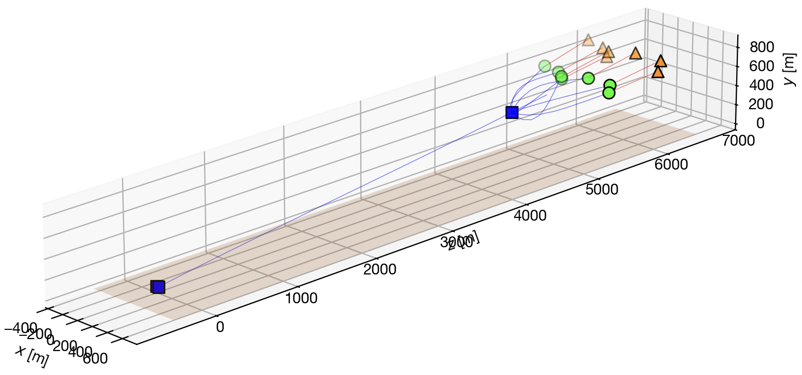
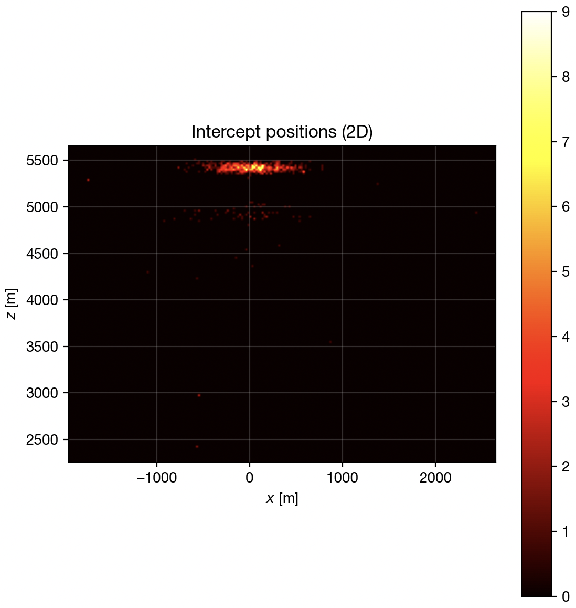
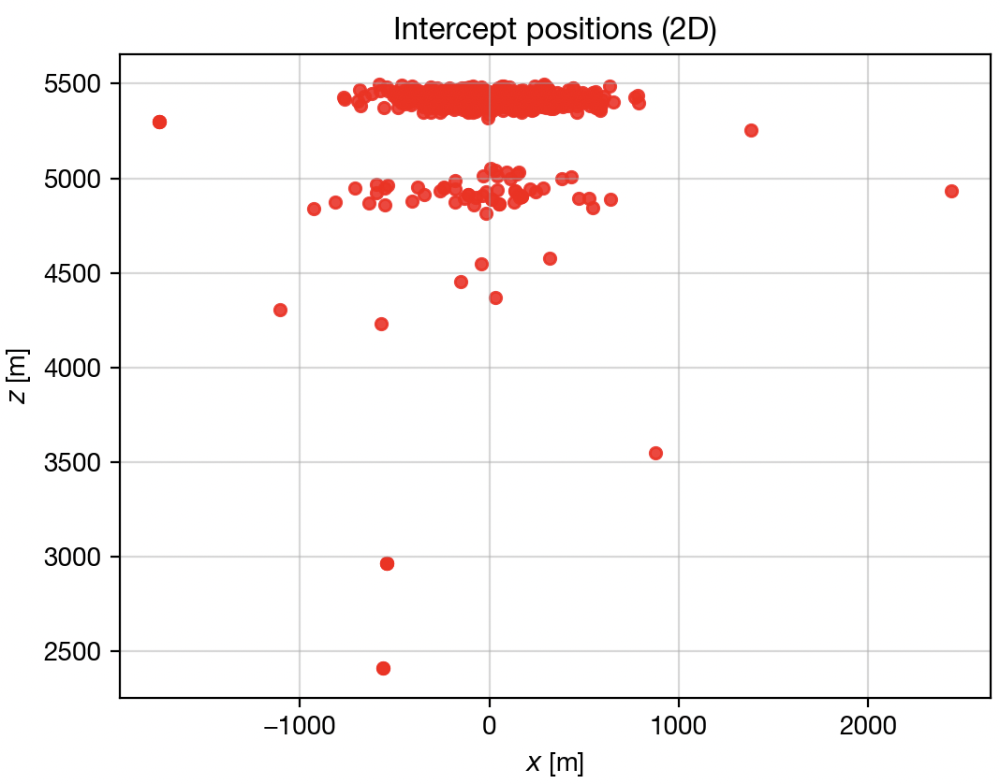

# Simulation Logging

This guide provides instructions on how to access and interpret the simulation logs.
The `SimMonitor` class outputs a telemetry file and an event log, which can be visualized using the provided `visualize_log.py` script.
To aggregate logs from multiple runs kicked off using a run configuration, we have provided a `process_run.py` script.

## Overview



Simulation logs capture detailed telemetry and event data from each simulation run.
These logs are essential for debugging, performance analysis, and understanding the behavior of agents within the simulation.
The [`SimMonitor` class](https://github.com/PisterLab/micromissiles-unity/blob/master/Assets/Scripts/Monitors/SimMonitor.cs) is responsible for:
- Collecting agent state data at some logging frequency.
- Writing telemetry data to `sim_telemetry_*.bin` and converting the binary file to `sim_telemetry_*.csv`.
- Recording significant events to `sim_events_*.csv`.
- Organizing logs into timestamped directories for each simulation run.

Logs are exported to the `Logs` directory in your operating system's [persistent data path](https://docs.unity3d.com/ScriptReference/Application-persistentDataPath.html).

**Operating System** | **Log directory**
---------------------|-------------------------------------------------------------
Windows              | `C:\Users\<user>\AppData\LocalLow\BAMLAB\micromissiles\Logs`
Mac                  | `~/Library/Application Support/BAMLAB/micromissiles/Logs`
Linux                | `~/.config/unity3d/BAMLAB/micromissiles/Logs`

### Log Directory

Simulation logs are organized into timestamped directories within the `Logs` directory.
Each simulation run generates a new subdirectory with the timestamp of the run, and each simulation configuration produces two CSV files:
- **Telemetry file (`sim_telemetry_*.csv`)**: Contains detailed state information for each agent at each time step. The telemetry CSV file is converted from an accompanying `sim_telemetry_*.bin` binary file.
- **Event log (`sim_events_*.csv`)**: Records significant events such as hits, misses, agent creation, and termination.

If the simulation run was executed interactively through the Unity Editor or through the command line without a run configuration provided, the logs will be stored in a directory called `run_<timestamp>`.
Each engagement scenario will produce one telemetry file and one event log, so loading a new simulation configuration or restarting the simulation configuration generates additional CSV files.
```
Logs/
  ├── run_20251117_095849/
  │   ├── sim_telemetry_20251117_095849.bin
  │   ├── sim_telemetry_20251117_095849.csv
  │   ├── sim_events_20251117_095849.csv
  │   │
  │   │   # Corresponds to a different simulation configuration in the same simulation run.
  │   ├── sim_telemetry_20251117_095912.bin
  │   ├── sim_telemetry_20251117_095912.csv
  │   └── sim_events_20251117_095912.csv
  ├── run_20251117_105038/
  │   ├── sim_telemetry_20251117_105038.bin
  │   ├── sim_telemetry_20251117_105038.csv
  │   └── sim_events_20251117_105038.csv
  │
  └── ...
```

If the simulation run was executed through the command line with a run configuration provided, the logs will be stored in a parent directory called `<run_config_name>_<timestamp>`.
The logs of each simulation run are then stored in subdirectories within this parent directory, called `run_<run_index>_seed_<seed>`.
Since a run configuration is provided, the simulation does not automatically restart on conclusion, so there are only two CSV files per subdirectory.
```
Logs/
  ├── batch_7_quadcopters_20251117_095849/
  │   ├── run_1_seed_200/
  │   │   ├── sim_telemetry_20251117_095849.bin
  │   │   ├── sim_telemetry_20251117_095849.csv
  │   │   └── sim_events_20251117_095849.csv
  │   ├── run_2_seed_201/
  │   │   ├── sim_telemetry_20251117_095902.bin
  │   │   ├── sim_telemetry_20251117_095902.csv
  │   │   └── sim_events_20251117_095902.csv
  │   └── ...
  │
  ├── batch_5_swarms_100_ucav_20251117_105038/
  │   ├── run_1_seed_100/
  │   │   ├── sim_telemetry_20251117_105038.bin
  │   │   ├── sim_telemetry_20251117_105038.csv
  │   │   └── sim_events_20251117_105038.csv
  │   ├── run_2_seed_101/
  │   │   ├── sim_telemetry_20251117_105228.bin
  │   │   ├── sim_telemetry_20251117_105228.csv
  │   │   └── sim_events_20251117_105228.csv
  │   └── ...
  │
  └── ...
```

## Telemetry File

The telemetry file provides a snapshot of the simulation at each time step for every agent.
Key columns include:
- **`Time`**: Simulation time at the snapshot.
- **`AgentType`**: Type of the agent, e.g., `CarrierInterceptor`, `MissileInterceptor`, `FixedWingThreat`, or `RotaryWingThreat`.
- **`AgentID`**: Unique identifier for each agent, e.g., `Micromissile_Interceptor_6` or `Quadcopter_Threat_2`.
- **`PositionX`**, **`PositionY`**, **`PositionZ`**: Position of the agent.
- **`VelocityX`**, **`VelocityY`**, **`VelocityZ`**: Velocity of the agent.

## Event Log

The event log records significant events within the simulation.
Key columns include:
- **`Time`**: Simulation time when the event occurred.
- **`Event`**: Type of event, e.g., `NEW_INTERCEPTOR`, `NEW_THREAT`, `INTERCEPTOR_HIT`, `INTERCEPTOR_MISS`, `THREAT_HIT`, or `THREAT_MISS`.
- **`AgentType`**: Type of the agent, e.g., `CarrierInterceptor`, `MissileInterceptor`, `FixedWingThreat`, or `RotaryWingThreat`.
- **`AgentID`**: Unique identifier for each agent, e.g., `Micromissile_Interceptor_6`.
- **`PositionX`**, **`PositionY`**, **`PositionZ`**: Position where the event occurred.

## Log Visualizer

`visualize_log.py` is an example script provided to help visualize the agent trajectories and events in a 3D plot.
It is included in the `Tools` directory of the release.

### Requirements

To run `visualize_log.py`, ensure that you have Python 3 installed on your system and that you have the following Python libraries:
- **`absl-py`**
- **`matplotlib`**
- **`numpy`**
- **`pandas`**

### Visualizing the Log

Run the script as follows:
```bash
python3 Tools/visualize_log.py \
    --telemetry_file path/to/sim_telemetry_file.csv \
    --event_log path/to/sim_events_file.csv
```

If either the telemetry file or the event log is not provided, the script will automatically locate the most recent `sim_telemetry_*.csv` and `sim_events_*.csv` files within the provided `--log_search_dir`.
If `--log_search_dir` is not provided, it defaults to the persistent data path.

The script then outputs a summary of the events, including the total number of interceptor hits and misses.
```
Total number of events: 31.
Event counts:
  NEW_INTERCEPTOR: 9
  NEW_THREAT: 7
  THREAT_MISS: 7
  INTERCEPTOR_HIT: 7
  INTERCEPTOR_MISS: 1
Total duration of events: 19.84 seconds (from 0.00 to 19.84).
Number of interceptor hits recorded: 7.
  First hit at 11.37, last hit at 19.84.
Number of interceptor misses recorded: 1.
  First miss at 11.41, last miss at 11.41.
```

Finally, the script plots the agent trajectories and marks events, such as interceptor hits and misses, in a 3D plot.

## Run Processor

If the simulation run was kicked off using a run configuration, you can use the provided `process_run.py` script to aggregate metrics across multiple simulation runs and analyze and visualize them.
`process_run.py` is included in the `Tools` directory of the release.

### Requirements

To run `process_run.py`, ensure that you have Python 3 installed on your system and that you have the following Python libraries:
- **`absl-py`**
- **`matplotlib`**
- **`numpy`**
- **`pandas`**

### Processing a Run

Run the script as follows:
```bash
python3 Tools/process_run.py --run_log_dir path/to/run_log_directory_20251117_095849
```

If `--run_log_dir` is not provided, the script will automatically locate the most recent subdirectory within the provided `--run_log_search_dir`.
If `--run_log_search_dir` is not provided, it defaults to the persistent data path.

The script then aggregates the events for all telemetry files and event logs found within the log directory and its subdirectories.
```
Aggregating the stats for 10 runs found in the log directory.
  Number of missile interceptors: mean: 9.800000, std: 3.429286.
  Number of missile interceptor hits: mean: 7.000000, std: 0.447214.
  Number of missile interceptor misses: mean: 2.000000, std: 1.341641.
  Missile interceptor hit rate: mean: 0.794753, std: 0.097569.
  Missile interceptor efficiency: mean: 0.792857, std: 0.229129.
  Minimum intercept distance: mean: 4993.276801, std: 189.367052.
```

Each statistic is implemented as a `Metric`, which is evaluated on each simulation run.
- A `ScalarMetric` is a single numerical output from a single simulation run, such as the number of interceptors, the number of hits and misses, and the minimum intercept distance.
- A `MultiMetric` outputs a list of an arbitrary type from a single simulation run, such as all intercept positions.
These metrics are then aggregated and analyzed for all simulation runs.

`process_run.py` also plots a heatmap and a scatter plot of the 2D intercept positions (ignoring elevation).

| Heatmap | Scatter Plot |
|---------|--------------|
|  |  |
