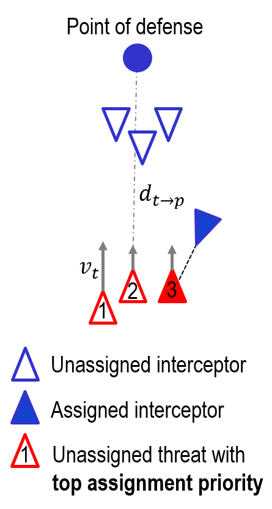

# Simulator Overview

## Introduction

The simulator performs a multi-agent simulation between two types of agents: interceptors and threats. The threats will target the static asset, located at the origin of the coordinate system, and the interceptors will defend the asset from the incoming threats.

There are two types of interceptors:
- **Carrier interceptors**: interceptors that carry and dispense other interceptors (e.g., Hydra-70 rockets)
- **Missile interceptors**: interceptors that pursue threats (e.g., micromissiles)

There are also two types of threats:
- **Fixed-wing threats**: Pursue their targets using proportional navigation (PN)
- **Rotary-wing threats**: Pursue their targets using direct linear guidance

## Simulator Physics

### Agent System Model

Each agent is modeled as a point mass, i.e., a 3-DOF body ignoring any rotations. It also has instantaneous acceleration in all directions, subject to constraints, because we do not model any sensing delay, actuation delay, or airframe delay. Finally, we abstract away the aerodynamics of the agents, so we do not model the angle of attack or stall.

As a point mass, each agent is represented by a six-dimensional state vector consisting of the agent's three-dimensional position and three-dimensional velocity. The input to the system is a three-dimensional acceleration vector.

The state vector is given by:
$$
\vec{x}(t) = \begin{bmatrix}
  \vec{p}(t) \\
  \vec{v}(t)
\end{bmatrix} \in \mathbb{R}^6,
$$
where $\vec{p}(t) \in \mathbb{R}^3$ denotes the agent's position and $\vec{v}(t) \in \mathbb{R}^3$ denotes the agent's velocity in the Cartesian coordinates.

The input vector is given by:
$$
\vec{u}(t) = \vec{a}(t) \in \mathbb{R}^3,
$$
where $\vec{a}(t) \in \mathbb{R}^3$ denotes the agent's acceleration.

The nonlinear state evolution equation is given by:
$$
\frac{d}{dt} \vec{x}(t) = \begin{bmatrix}
  \vec{v}(t) \\
  \vec{a}(t) - \vec{g} - \left(\frac{F_D(\vec{v}(t))}{m} + \frac{\left\|\vec{a}_\perp(t) + \vec{g}_\perp\right\|}{(L/D)}\right) \frac{\vec{v}(t)}{\|\vec{v}(t)\|}
\end{bmatrix},
$$
where $\vec{g} = \begin{bmatrix} 0 \\ 0 \\ g \end{bmatrix}$ represents the acceleration due to gravity, $\frac{F_D(\vec{v}(t))}{m}$ represents the deceleration along the agent's velocity vector due to air drag, and $\frac{\left\|\vec{a}_\perp(t) + \vec{g}_\perp\right\|}{(L/D)}$ represents the deleceration along the agent's velocity vector due to lift-induced drag.

Any acceleration normal to the agent's velocity vector, including the components of the acceleration vector $\vec{a}_\perp(t)$ and gravity vector $\vec{g}_\perp$ that are normal to the velocity vector, will induce some lift-induced drag.
$$
\vec{a}_\perp(t) = \vec{a}(t) - \text{proj}_{\vec{v}(t)}(\vec{a}(t))
$$
$$
\vec{g}_\perp = \vec{g} - \text{proj}_{\vec{v}(t)}(\vec{g})
$$

### Agent Acceleration

The agent acceleration is given by:
$$
\frac{d}{dt} \vec{v}(t) = \vec{a}(t) - \vec{g} - \left(\frac{F_D(\vec{v}(t))}{m} + \frac{\left\|\vec{a}_\perp(t) + \vec{g}_\perp\right\|}{(L/D)}\right) \frac{\vec{v}(t)}{\|\vec{v}(t)\|}
$$

The air drag is given by:
$$
F_D(\vec{v}(t)) = \frac{1}{2} \rho C_D A\|\vec{v}(t)\|^2,
$$
where $\rho$ is the air density that decays exponentially with altitude: $\rho = 1.204 \frac{\text{kg}}{\text{m}^3} \cdot e^{-\frac{\text{altitude}}{10.4\text{ km}}}$, $C_D$ is the airframe's coefficient of drag, and $A$ is the cross-sectional area.

For all angles of attack, we specify a constant $(L/D)$ ratio.

We do impose some constraints on the acceleration:
- Interceptors can only accelerate normal to their velocity (no thrust during the midcourse phase), i.e., $\vec{a}(t) \cdot \vec{v}(t) = 0$. Therefore, $\vec{a}(t) = \vec{a}_\perp(t)$ for interceptors.
- Threats may have some forward acceleration, which is bounded by the maximum forward acceleration specified for each threat type.
- The normal acceleration is constrained by the maximum number of g's that the agent's airframe can pull:
  $$
  \|\vec{a}_\perp(t)\| \leq \left(\frac{\|\vec{v}(t)\|}{v_{ref}}\right)^2 a_{ref}
  $$
  $a_{ref}$ denotes the maximum normal acceleration that the airframe can pull at the reference speed $v_{ref}$.

- Air drag: $F_D(\vec{v}(t)) = \frac{1}{2}\rho C_D A\|\vec{v}(t)\|^2$
  - The air density decays exponentially with altitude: $\rho = 1.204 \frac{\text{kg}}{\text{m}^3} \cdot e^{-\frac{\text{altitude}}{10.4\text{ km}}}$.

## Simulator Behaviors

### Guidance & Navigation

**Proportional Navigation**

{width=60%}

Using the fact that constant bearing decreasing range (CBDR) leads to a collision, we apply an acceleration normal to the velocity vector to correct for any bearing drift. In the simulator, proportional navigation follows the simple control law:
$$
\vec{a}_\perp = K \dot{\lambda} v,
$$
where $K$ is the navigation gain, $\dot{\lambda}$ is the rate of change of the bearing, and $v$ is the closing velocity.
For interceptors, we choose $K = 3$.

Proportional navigation is effective for non-accelerating targets and guarantees a collision.

**Augmented Proportional Navigation**

Augmented proportional navigation adds a feedthrough term proportional to the agent’s acceleration:
$$
\vec{a}_\perp = K \left(\dot{\lambda} v + \frac{1}{2} \vec{a}_{T}\right),
$$
where $\vec{a}_T$ is the target’s acceleration that is normal to the agent's velocity vector.

APN is equivalent to true PN if the target is not accelerating.

### Interceptor Assignment

**Threat-based assignment**

{width=40%}

When submunitions are dispensed (e.g., micromissiles from Hydra-70s), they are assigned a threat to intercept. The assignment algorithm prefers assigning an interceptor to each threat before doubling up on previously assigned threats.

Given the list of threats, the simulator first sorts the threats as follows:
1. Sorting (descending) by the number of already assigned interceptors
2. Sorting (ascending) by threat value, where the threat value of a threat is given by:
  $$
  V_{threat} = \frac{1}{d_{t\rightarrow p}} \cdot \|\vec{v}(t)\|,
  $$
  where $\|v_t\|$ is the threat's speed and $d_{t\rightarrow p}$ is the threat's distance from the asset.
After sorting the threats, we simply assign interceptors down the list.

Note that this algorithm may not be optimal but is a good starting point.

### Intercept evasion tactics

{width=60%}

When interceptors get too close to their intended target, the threat performs an evasive maneuver to expend the interceptor's speed and remaining energy. During the evasive maneuver, the threat performs the following:
1. The threat accelerates to its maximum speed.
2. The threat turns away from the incoming interceptor at its maximum normal acceleration and tries to align its velocity vector to be normal to the interceptor's velocity vector.
Since the threat applies a normal acceleration, the interceptor must turn too and thus lose speed due to the lift-induced drag.

If the threat is too close to the ground, however, it must ensure that it does not collide with the ground. Therefore, as it approaches the ground, the threat instead performs a linear combination of:
1. turning to evade the interceptor, as described above, and
2. turning parallel to the ground.
