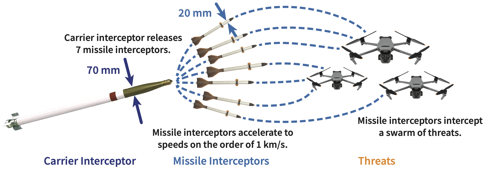
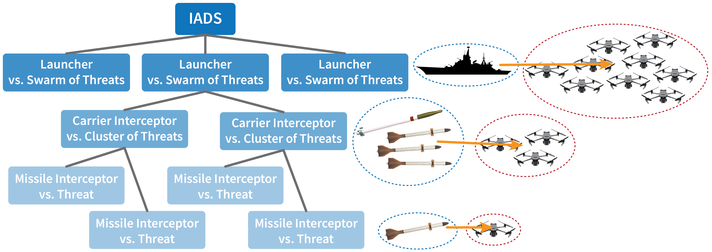
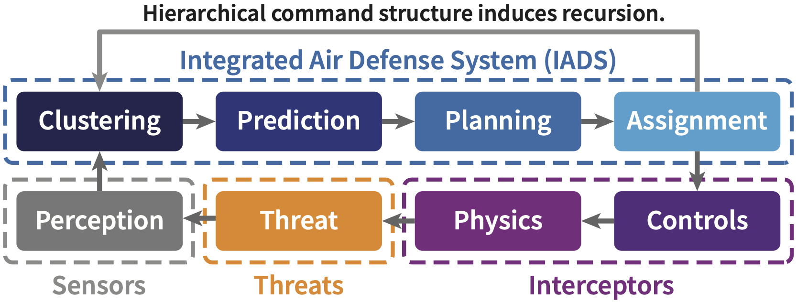
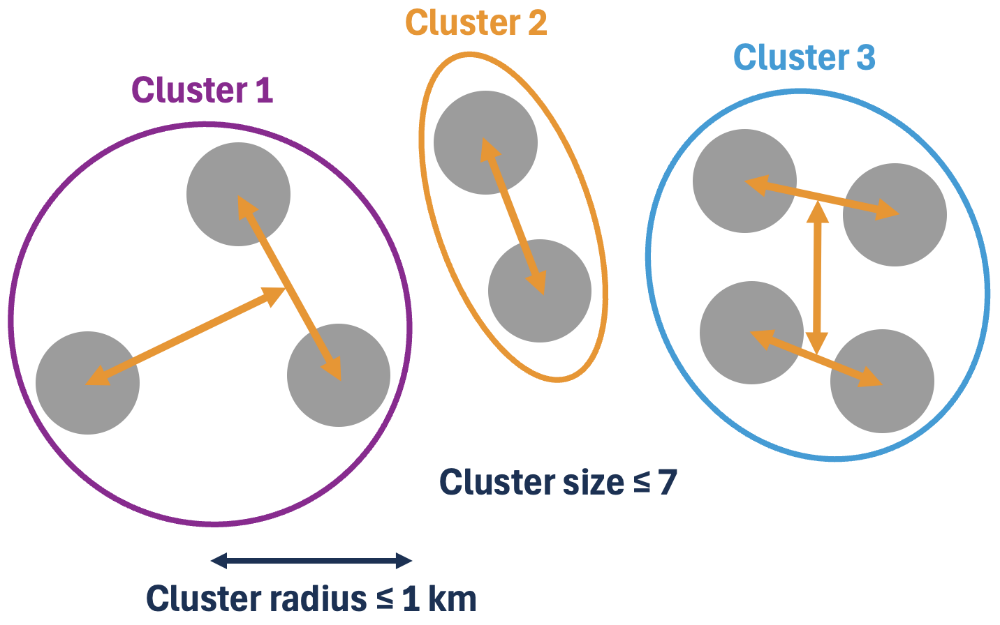
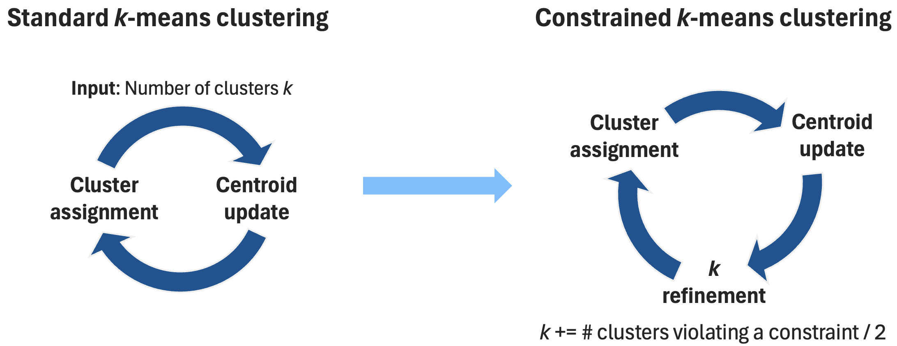
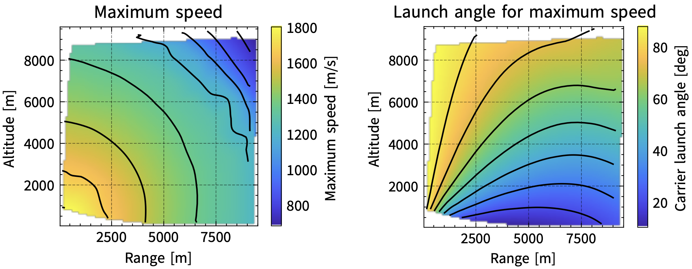
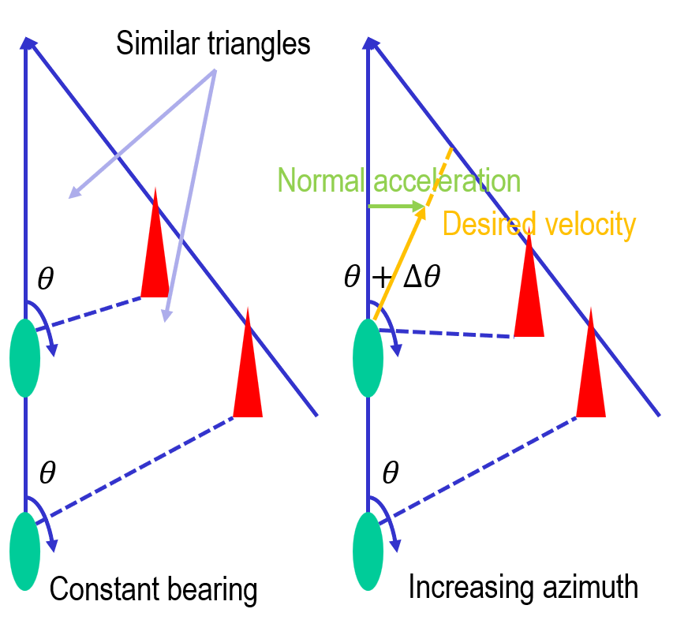
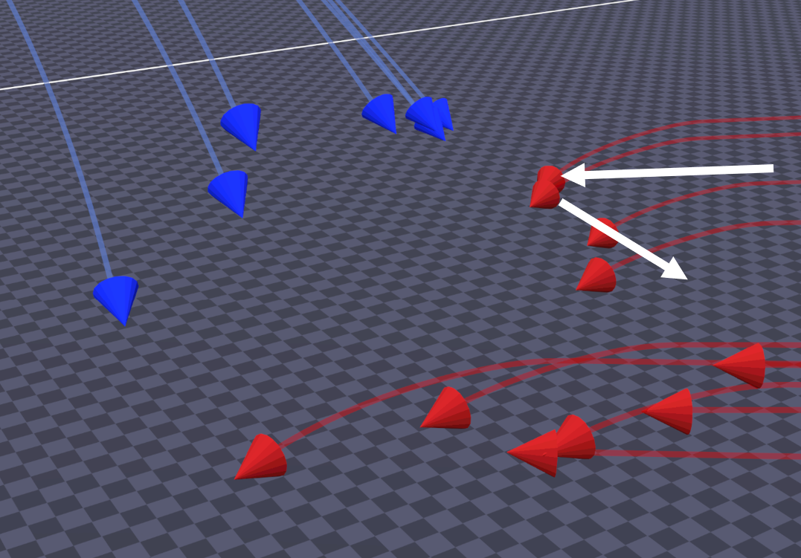

# Simulator Overview

This simulator is designed to explore strategies and tactics for large-scale swarm-on-swarm combat, particularly in the area of missile and UAV defense, and with a bias toward small smart munitions.

In the initial phase of the project, we have implemented a simple aerodynamic model that roughly estimates the capabilities of different interceptors and threats, including (augmented) proportional navigation for the interceptors and the ability to evade for the threats.
Both interceptors and threats have perfect knowledge of their opponents at a configurable sensor update rate.
While the initial positions and velocities of the threats are hard-coded for each engagement scenario, our simulator automatically clusters the threats, predicts their future positions, plans when to automatically launch the interceptors, and assigns a threat to each interceptor to pursue.

## Introduction

To minimize the engagement cost, maximize the terminal speed and agility, and simultaneously defend against multiple threats, we propose using a hierarchical air defense system (ADS), where cheap, possibly unguided "carrier interceptors" carry multiple smaller, intelligent missile interceptors as submunitions.
Once the carrier interceptors are close to their intended cluster of targets, they each release the missile interceptors that light their rocket motor and accelerate up to speeds on the order of 1 km/s.
The missile interceptors rely on the carrier interceptors’ track data as well as their own radio frequency and/or optical sensors to acquire their targets.
Then, they distribute the task of engaging the many threats among themselves.



The command structure is hierarchical for better autonomy and tractability because to successfully defend against hundreds of threats, we intend to recursively cluster and assign them to groups of interceptors.
At the bottom of the hierarchy, a single missile interceptor is assigned to puruse a single threat.
At the next level of the hierarchy, a carrier interceptor is assigned to defend against a cluster of threats.
Above that, a salvo of interceptors is assigned to defend against a swarm of threats, and so on.

{width=80%}

The simulator implements the following architecture to tractably defend against a swarm of threats.
This hierarchical command structure naturally leads to a recursive architecture.
Details for each block are provided below in this page.



The simulator architecture was designed to be as modular as possible with interfaces for each component to facilitate the development of and comparison between new algorithms.
Future versions will model the non-idealities of the sensors, considering the sensor range and resolution limits, and implement a realistic communication model between the interceptors.
We also plan to explore optimal control and machine learning approaches to launch sequencing, target assignment, trajectory generation, and control.

### Agents

The simulator performs a multi-agent simulation between two types of agents: interceptors and threats.
The threats will target the static asset, located at the origin of the coordinate system, and the interceptors will defend the asset from the incoming threats.
Currently, all interceptors are launched from the origin of the coordinate system as well.

There are two types of interceptors:
- **Carrier interceptors**: interceptors that carry and dispense other interceptors (e.g., Hydra-70 rockets).
- **Missile interceptors**: interceptors that pursue threats (e.g., micromissiles).

There are also two types of threats:
- **Fixed-wing threats**: Pursue their targets using proportional navigation.
- **Rotary-wing threats**: Pursue their targets using direct linear guidance.

## Physics

### Agent Model

Each agent is modeled as a point mass, i.e., a 3-DOF body without rotational dynamics.
It has instantaneous acceleration in all directions, subject to constraints, because we do not model any sensing, actuation, or airframe delays.
As a point mass, each agent is represented by a six-dimensional state vector consisting of the agent's three-dimensional position and three-dimensional velocity.
The input to the system is a three-dimensional acceleration vector.

The state vector is given by:
$$
\vec{x}(t) = \begin{bmatrix}
  \vec{p}(t) \\
  \vec{v}(t) \\
\end{bmatrix} \in \mathbb{R}^6,
$$
where $\vec{p}(t) \in \mathbb{R}^3$ denotes the agent's position and $\vec{v}(t) \in \mathbb{R}^3$ denotes the agent's velocity in the Cartesian coordinates.

The input vector is given by:
$$
\vec{u}(t) = \vec{a}(t) \in \mathbb{R}^3,
$$
where $\vec{a}(t) \in \mathbb{R}^3$ denotes the agent's acceleration.

The nonlinear state evolution equation is given by:
$$
\frac{d}{dt} \vec{x}(t) = \begin{bmatrix}
  \vec{v}(t) \\
  \vec{a}(t) - \vec{g} - \left(\frac{F_D(\|\vec{v}(t)\|)}{m} + \frac{\left\|\vec{a}_\perp(t)\right\|}{(L/D)}\right) \frac{\vec{v}(t)}{\|\vec{v}(t)\|}
\end{bmatrix},
$$
where $\vec{g} = \begin{bmatrix} 0 \\ 0 \\ g \end{bmatrix}$ represents the acceleration due to gravity, $\frac{F_D(\|\vec{v}(t)\|)}{m}$ represents the deceleration along the agent's velocity vector due to air drag, and $\frac{\left\|\vec{a}_\perp(t)\right\|}{(L/D)}$ represents the deleceration along the agent's velocity vector due to lift-induced drag.
Any acceleration normal to the agent's velocity vector, including the components of the acceleration vector $\vec{a}_\perp(t)$ and gravity vector $\vec{g}_\perp$ that are normal to the velocity vector, will induce some lift-induced drag.
$$
\vec{a}_\perp(t) = (\vec{a}(t) + \vec{g}) - \text{proj}_{\vec{v}(t)}(\vec{a}(t) + \vec{g})
$$

### Agent Acceleration

The agent acceleration is given by:
$$
\frac{d}{dt} \vec{v}(t) = \vec{a}(t) - \vec{g} - \left(\frac{F_D(\|\vec{v}(t)\|)}{m} + \frac{\left\|\vec{a}_\perp(t)\right\|}{(L/D)}\right) \frac{\vec{v}(t)}{\|\vec{v}(t)\|}
$$
Unlike interceptors, threats are not subject to drag or gravity.

The air drag is given by:
$$
F_D(\|\vec{v}(t)\|) = \frac{1}{2} \rho C_D A\|\vec{v}(t)\|^2,
$$
where $\rho$ is the air density that decays exponentially with altitude: $\rho = 1.204 \frac{\text{kg}}{\text{m}^3} \cdot e^{-\frac{\text{altitude}}{10.4\text{ km}}}$, $C_D$ is the airframe's coefficient of drag, and $A$ is the cross-sectional area.
For all angles of attack, we specify a constant $(L/D)$ ratio.

We do impose some constraints on the acceleration:
- Interceptors can only accelerate normal to their velocity (no thrust during the midcourse phase), i.e., $\vec{a}(t) \cdot \vec{v}(t) = 0$.
  Therefore, $\vec{a}(t) = \vec{a}_\perp(t)$ for interceptors.
- Threats may have some forward acceleration, which is bounded by the maximum forward acceleration specified for each threat type.
- The normal acceleration is constrained by the maximum number of g's that the agent's airframe can pull:
  $$
  \|\vec{a}_\perp(t)\| \leq \left(\frac{\|\vec{v}(t)\|}{v_{\text{ref}}}\right)^2 a_{\text{ref}}
  $$
  $a_{\text{ref}}$ denotes the maximum normal acceleration that the airframe can pull at the reference speed $v_{\text{ref}}$.

## Perception

Currently, all agents are equipped with an ideal sensor, one that can peek through the fog of war with no noise and no delay.
Sensing is performed within the agent's frame of reference using spherical coordinates, so each sensor output $\vec{y}$ is a nine-dimensional vector.
$$
\vec{y} = \begin{bmatrix}
  \vec{y}_p \\
  \vec{y}_v \\
  \vec{y}_a \\
\end{bmatrix} \in \mathbb{R}^9,
$$
where $\vec{y}_p \in \mathbb{R}^3$ denotes the three-dimensional position difference between the agent and its sensing target, $\vec{y}_v$ denotes the three-dimensional velocity difference between the agent and its sensing target, and $\vec{y}_a$ denotes the three-dimensional acceleration of the sensing target.
$\vec{y}_p$ and $\vec{y}_v$ are both given in spherical coordinates in the agent's frame of reference while $\vec{y}_a$ is in Cartesian coordinates.

Interceptors are constrained in their sensor update frequency, which is configurable for each interceptor type.
As a result, interceptors can change their actuation input at a rate faster than the sensor update frequency.
The simulator currently uses a naive guidance filter that simply performs a zero-order hold interpolation on the latest sensor output and applies the latest acceleration to a model of the sensing target until the next sensor output arrives and updates the model's position, velocity, and acceleration.
In other words, for $nT \leq t < (n + 1)T$, where $T$ is the sensor update period, the simple target model is as follows:
$$
\frac{d}{dt} \begin{bmatrix}
  \vec{p}(t) \\
  \vec{v}(t) \\
\end{bmatrix} = \begin{bmatrix}
  \vec{v}(t) \\
  \vec{a}(t)|_{t = nT} \\
\end{bmatrix},
$$
where the initial conditions $\vec{p}(t)|_{t = nT}$ and $\vec{v}(t)|_{t = nT}$ are set by the latest sensor output.

Threats are assumed to be omniscient, so they have no frequency constraint on their sensor output and know the positions, velocities, and accelerations of all interceptors at all times.

## Clustering

{width=60%}

To cluster the threats into more manageable clusters, we use a size and radius-constrained clustering algorithm.
- **Size constraint**: Maximum 7 threats per cluster
- **Radius constraint**: Cluster radius must be less than or equal to 1 km
The size constraint is necessary, especially at the bottommost level of the hierarchy, because each carrier interceptor only carries up to seven missile interceptors.
The radius constraint ensures that when the submunitions are released, each missile interceptor will have sufficient terminal speed to reach all of the threats within the cluster.
As each cluster represents an additional launched interceptor, the algorithm should minimize the number of clusters $k$ to minimize the engagement cost.

### Agglomerative Clustering

A simple greedy algorithm to satisfy both the size and radius constraints is agglomerative clustering.
Each agent to be clustered starts in its own cluster, and while the distance between the two closest clusters is less than the radius constraint, the two closest clusters are merged together as long as the resulting cluster satisfies the size constraint.
If the two closest clusters cannot be merged due to the size constraint, the algorithm proceeds to the next two closest clusters.
This clustering algorithm continues until no more clusters can be merged.

### Constrained $k$-means Clustering

The simulator also implements a constrained $k$-means clustering algorithm that satisfies both the radius and the size constraints.
The standard $k$-means clustering algorithm is modified to include a $k$ refinement step, where the number of clusters $k$ is increased depending on the number of clusters that do not satisfy both constraints.

{width=80%}

### Minimum Cost Flow Clustering

Instead of modifying the standard $k$-means clustering algorithm, we have explored modifying the size-constrained $k$-means clustering algorithm proposed by Bradley et al., [2000](https://www.microsoft.com/en-us/research/wp-content/uploads/2016/02/tr-2000-65.pdf).
We introduce a $k$ refinement step, where the numebr of clusters $k$ is increased depending on the number of clusters that do not satisfy the radius constraint.
The centroids of the new clusters are placed at the agents that are farthest away from their assigned clusters' centroids.

This algorithm has yet to be implemented in the Unity simulator.

## Prediction

The simulator currently uses a simple predictor, where the future position of the threat is extrapolated based on the threat's current velocity and acceleration.
Future work involves using a probabilistic predictor that accounts for the threat's maneuverability.

### Predictor-Planner Convergence

The predictor estimates the position of the threat at some given time-to-intercept while the planner estimates the time-to-intercept given the threat position.
In order to find the time-to-intercept and the intercept position, the predictor and the planner must converge to the same time-to-intercept and intercept position.

The simulator achieves predictor-planner convergence by performing a 2-step iterative process that repeatedly updates the time-to-intercept estimate using the planner and then updates the intercept position using the predictor.

The iterative launch planner also performs a few sanity checks to check for corner cases.
For example, this algorithm may not always converge to a solution, so to prevent an infinite loop, the algorithm should declare no launch if the distance between the intercept position and the estimated threat position exceed some threshold.
```csharp
// Check that the intercept position and the predicted position are within some threshold
// distance of each other.
if (Vector3.Distance(interceptPosition, targetPosition) >= InterceptPositionThreshold) {
  return LaunchPlan.NoLaunch;
}
```
Furthermore, the algorithm checks that the threat is indeed heading towards the intercept position.
```csharp
// Check that the target is moving towards the intercept position. Otherwise, the interceptor
// should wait to be launched.
Vector3 targetToInterceptPosition = interceptPosition - initialState.Position;
Vector3 targetToPredictedPosition = targetPosition - initialState.Position;
if (Vector3.Dot(targetToInterceptPosition, targetToPredictedPosition) < 0) {
  return LaunchPlan.NoLaunch;
}
```
Finally, the interceptor might be launched into the posterior hemisphere away from the threat if the estimated intercept position is behind the launch position.
The solution is to delay the launch until the intercept position is in the anterior hemisphere.
```csharp
// Check that the interceptor is moving towards the target. If the target is moving too fast,
// the interceptor might be launched backwards because the intercept position and the predicted
// position are behind the asset. In this case, the interceptor should wait to be launched.
Vector3 interceptorToInterceptPosition = interceptPosition;
Vector3 threatToPredictedPosition = targetPosition - initialState.Position;
if (Vector3.Dot(interceptorToInterceptPosition, threatToPredictedPosition) > 0) {
  return LaunchPlan.NoLaunch;
}
```

## Planning

### Launch Angle Planner Lookup Table

Since the dynamics of the interceptors is nonlinear, the simulator implements a lookup table to determine the launch angle at which the carrier interceptor should be launched given the range and altitude of the threat.
The planner attempts to maximize the terminal speed to ensure the maximum kill probability.

To generate the lookup table, the nonlinear dynamics of the carrier interceptors along with those of the released missile interceptors were simulated while sweeping through the launch angle, the submunition dispense time, and the submunition motor light time.
We realized that the maximum speed is achieved if the missile interceptors light their motors directly prior to reaching the intercept position.

The resulting trajectory points were interpolated to generate the lookup table shown below:

{width=80%}

In the simulator, only the un-interpolated samples of the lookup table are used, and the current launch angle planner performs a nearest-neighbor interpolation to determine the optimal launch angle.

## Assignment

### Maximum Speed Assignment

The simulator assigns the threats to the interceptors such that the terminal speed of each engagement is maximized, which maximizes the overall kill probability.
For any assignment between an interceptor and a threat, we can assign a cost that represents the loss of the interceptor’s speed as a result of both the distance to be covered and the bearing change required for the intercept.

## Controls

**Proportional Navigation**

{width=60%}

Using the fact that constant bearing decreasing range (CBDR) leads to a collision, we apply an acceleration normal to the velocity vector to correct for any bearing drift.
In the simulator, proportional navigation follows the simple control law:
$$
\vec{a}_\perp = K \dot{\vec{\lambda}} v,
$$
where $K$ is the navigation gain, $\dot{\vec{\lambda}}$ is the rate of change of the bearing, and $v$ is the closing velocity.
For interceptors, we choose $K = 3$.

Proportional navigation is effective for non-accelerating targets and guarantees a collision.
However, simply using true proportional navigation as a guidance law leads to some undesired behavior when the rate of change of the bearing $\dot{\vec{\lambda}}$ is near zero.
1. **Increasing range**:
   The closing velocity may be negative, i.e., the distance between the agent and its target may actually be increasing.
   In this case, the agent should apply a maximum normal acceleration in any direction to turn around, but since $\|\dot{\vec{\lambda}}\| \approx 0$, the normal acceleration is minimal.
   To overcome this issue, the navigation gain is increased significantly if the closing velocity is negative.
   ```csharp
   // Handle the case where the closing velocity is negative.
   if (closingVelocity < 0) {
     navigationGain = Mathf.Max(1f, Mathf.Abs(closingVelocity) * 100f);
   }
   ```
2. **Spiral behavior**:
   If the target is at a near-constant ${90}^\circ$ bearing from the agent, the agent may end up in a spiral encircling the target because $\vec{\lambda}$ is roughly constant and so $\|\dot{\vec{\lambda}}\| \approx 0$.
   To overcome this limitation, the agent will apply a higher navigation gain if the target bearing is within $\pm {10}^\circ$ of ${90}^\circ$.
   ```csharp
   // Handle the case of the spiral behavior if the target is at a bearing of 90 degrees +- 10 degrees.
   if (Mathf.Abs(Mathf.Abs(sensorOutput.position.azimuth) - Mathf.PI / 2) < 0.2f ||
       Mathf.Abs(Mathf.Abs(sensorOutput.position.elevation) - Mathf.PI / 2) < 0.2f) {
     // Clamp the line-of-sight rate at 0.2 rad/s.
     float minLosRate = 0.2f;
     losRateAz = Mathf.Sign(losRateAz) * Mathf.Max(Mathf.Abs(losRateAz), minLosRate);
     losRateEl = Mathf.Sign(losRateEl) * Mathf.Max(Mathf.Abs(losRateEl), minLosRate);
     navigationGain = Mathf.Abs(closingVelocity) * 100f;
   }
   ```

**Augmented Proportional Navigation**

Augmented proportional navigation adds a feedthrough term proportional to the agent’s acceleration:
$$
\vec{a}_\perp = K \left(\dot{\vec{\lambda}} v + \frac{1}{2} \vec{a}_{\text{target}}\right),
$$
where $\vec{a}_{\text{target}}$ is the target’s acceleration that is normal to the agent's velocity vector.

Augmented proportional navigation is equivalent to true proportional navigation if the target is not accelerating.

**Ground Avoidance**

Gravity only acts on interceptors as the simulator assumes that the threats are able to compensate for gravity.
Currently, interceptors do not consider gravity when determining their acceleration input for the next simulation step.
As a result, gravity acts as a disturbance to each interceptor's dynamics system and may cause the interceptor to collide with the ground if not accounted for.

Threats may also collide with the ground, especially after having performed an evasion maneuver from pursuing interceptors.
The simulator implements a basic ground avoidance algorithm for the threats: If the threat's vertical speed will cause the threat to collide with the ground before the threat will hit the asset, the threat will adjust its vertical velocity to be a linear combination of navigating towards the asset and pulling up away from the ground.

```csharp
// Calculate the time to ground.
float altitude = transformPosition.y;
float sinkRate = -transformVelocity.y;
float timeToGround = altitude / sinkRate;

// Calculate the time to target.
float distanceToTarget = sensorOutput.position.range;
float timeToTarget = distanceToTarget / transformSpeed;

float groundProximityThreshold = Mathf.Abs(transformVelocity.y) * 5f;
if (sinkRate > 0 && timeToGround < timeToTarget) {
  // Evade upwards normal to the velocity.
  Vector3 upwardsDirection = Vector3.Cross(transformForward, transformRight);

  // For the y-component, interpolate between the calculated acceleration input and the upward acceleration.
  float blendFactor = 1 - (altitude / groundProximityThreshold);
  accelerationInput.y = Vector3.Lerp(accelerationInput, upwardsDirection * CalculateMaxNormalAcceleration(), blendFactor).y;
}
```

## Threat

### Intercept Evasion

{width=60%}

When interceptors get too close to their intended target, the threat performs an evasive maneuver to expend the interceptor's speed and remaining energy.
During the evasive maneuver, the threat performs the following:
1. The threat accelerates to its maximum speed.
2. The threat turns away from the incoming interceptor at its maximum normal acceleration and tries to align its velocity vector to be normal to the interceptor's velocity vector.
Since the threat applies a normal acceleration, the interceptor must turn too and thus sacrifice speed due to the lift-induced drag.
```csharp
// Evade the interceptor by aligning the threat's velocity vector to be normal to the interceptor's velocity vector.
Vector3 normalVelocity = Vector3.ProjectOnPlane(transformVelocity, interceptorVelocity);
Vector3 normalAccelerationDirection = Vector3.ProjectOnPlane(normalVelocity, transformVelocity).normalized;

// Turn away from the interceptor.
Vector3 relativePosition = interceptorPosition - transformPosition;
if (Vector3.Dot(relativePosition, normalAccelerationDirection) > 0) {
  normalAccelerationDirection *= -1;
}
```

If the threat is too close to the ground, however, it must ensure that it does not collide with the ground.
Therefore, as it approaches the ground, the threat instead performs a linear combination of:
1. turning to evade the interceptor, as described above, and
2. turning parallel to the ground.
```csharp
// Avoid evading straight down when near the ground.
float altitude = transformPosition.y;
float sinkRate = -transformVelocity.y;
float groundProximityThreshold = Mathf.Abs(transformVelocity.y) * 5f;
if (sinkRate > 0 && altitude < groundProximityThreshold) {
  // Determine evasion direction based on the bearing to the interceptor.
  Vector3 toInterceptor = interceptorPosition - transformPosition;
  Vector3 rightDirection = Vector3.Cross(Vector3.up, transform.forward);
  float angle = Vector3.SignedAngle(transform.forward, toInterceptor, Vector3.up);

  // Choose the direction that turns away from the interceptor.
  Vector3 bestHorizontalDirection = angle > 0 ? -rightDirection : rightDirection;

  // Interpolate between horizontal evasion and upward ground avoidance.
  float blendFactor = 1 - (altitude / groundProximityThreshold);
  normalAccelerationDirection = Vector3.Lerp(normalAccelerationDirection, bestHorizontalDirection + transform.up * 5f, blendFactor).normalized;
  }
```
