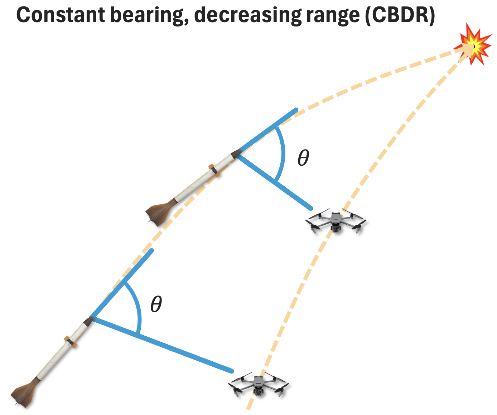

# Simulator Overview

## Introduction

Interceptors:
- Carrier interceptors: interceptors that carry and dispense other interceptors (e.g., Hydra-70)
- Missile interceptors: interceptors that pursue threats (e.g., micromissiles)

Threats:
- Fixed-wing threats: Pursue their targets using proportional navigation (PN)
- Rotary-wing threats: Pursue their targets using direct linear guidance

## Simulator Physics

### Agent flight dynamics model

Agents are modeled as a point mass (3-DOF simulation that ignores rotations) with instantaneous acceleration (no sensing delay, no actuation delay, no airframe delay).
- We do not model the aerodynamics of the agents (including the angle of attack)
- The input to the system is the instantaneous acceleration

- **State vector**: 
  $$
  \vec{x}(t) = \begin{bmatrix} \vec{p}(t) \\ \vec{v}(t) \end{bmatrix} \in \mathbb{R}^6
  $$

- **State evolution equation**: 
  $$
  \frac{d}{dt} \vec{x}(t) = 
  \begin{bmatrix} 
  \vec{a}(t) - \begin{bmatrix} 0 \\ 0 \\ g \end{bmatrix} - \left( \frac{F_D(\vec{v}(t))}{m} + \frac{\|\vec{a}(t) + \text{proj}_{\vec{v}(t)}\begin{bmatrix} 0 \\ 0 \\ g \end{bmatrix}\|}{(L/D)} \right) \frac{\vec{v}(t)}{\|\vec{v}(t)\|}
  \end{bmatrix}
  $$

  - **Acceleration input**: $\vec{a}(t)$
  - **Gravity**: $\begin{bmatrix} 0 \\ 0 \\ g \end{bmatrix}$
  - **Air drag**: $\frac{F_D(\vec{v}(t))}{m}$
  - **Lift-induced drag**: $\frac{\|\vec{a}(t) + \text{proj}_{\vec{v}(t)}\begin{bmatrix} 0 \\ 0 \\ g \end{bmatrix}\|}{(L/D)}$

### Agent Model Acceleration

The state evolution equation is:
$$
\frac{d}{dt} \vec{x}(t) = \begin{bmatrix} 
\vec{a}(t) - \begin{bmatrix} 0 \\ 0 \\ g \end{bmatrix} - \left(\frac{F_D(\vec{v}(t))}{m} + \frac{\|\vec{a}(t) + \text{proj}_{\vec{v}(t)}\begin{bmatrix} 0 \\ 0 \\ g \end{bmatrix}\|}{(L/D)} \right) \frac{\vec{v}(t)}{\|\vec{v}(t)\|}
\end{bmatrix}
$$

Key constraints and properties:

- Interceptors can only accelerate normal to their velocity (no thrust during midcourse): $\vec{a}(t) \cdot \vec{v}(t) = 0$; threats may have some forward acceleration

- The normal acceleration is constrained by the current velocity: $\|\vec{a}(t)\| \leq \left(\frac{\|\vec{v}(t)\|}{v_{ref}}\right)^2 a_{ref}$
  - Additionally for threats, there is a maximum forward acceleration depending on the threat type

- Air drag: $F_D(\vec{v}(t)) = \frac{1}{2}\rho C_D A\|\vec{v}(t)\|^2$
  - The air density decays exponentially with altitude: $\rho = 1.204 \frac{\text{kg}}{\text{m}^3} \cdot e^{-\frac{\text{altitude}}{10.4\text{ km}}}$

- We assume a constant L/D ratio for all angles of attack

## Simulator Behaviors

### Guidance & Navigation

**Proportional Navigation**

{width=60%}

Constant bearing decreasing range (CBDR) leads to a collision. Acceleration normal to the velocity vector is sufficient to correct for any bearing drift.  
Acceleration along the velocity vector is also difficult to realize physically.  
Proportional navigation follows the simple control law:  
$$ \vec{a}_n = K \dot{\lambda} v $$  
where $K$ is the navigation gain, $\dot{\lambda}$ is the rate of change of the bearing, and $v$ is the closing velocity.  
We choose $K = 3$ for interceptors.  
Proportional navigation is effective for non-accelerating targets.  

**Augmented Proportional Navigation**

Augmented proportional navigation adds a feedthrough term proportional to the agent’s acceleration:
$$ \vec{a}_n = K \left( \dot{\lambda} v + \frac{1}{2} \vec{a}_T \right) $$
where $\vec{a}_T$ is the target’s acceleration.  
APN is equivalent to true PN if the target is not accelerating.
