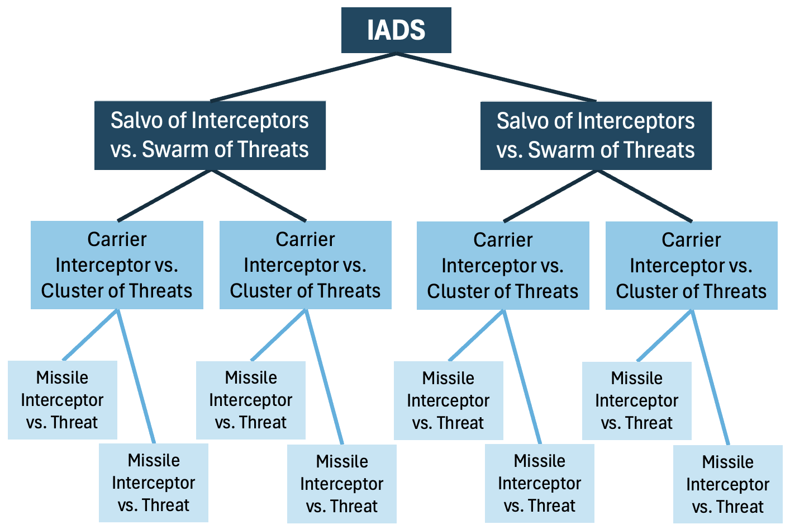

# Simulator Overview

This simulator is designed to explore strategies and tactics for large-scale swarm-on-swarm combat, particularly in the area of missile and UAV defense, and with a bias toward small smart munitions.

In the initial phase of the project, we have implemented a simple aerodynamic model that roughly estimates the capabilities of different interceptors and threats, including (augmented) proportional navigation for the interceptors and the ability to evade for the threats.
Both interceptors and threats have perfect knowledge of their opponents at a configurable sensor update rate.
While the initial positions and velocities of the threats are hard-coded for each engagement scenario, our simulator automatically clusters the threats, predicts their future positions, plans when to automatically launch the interceptors, and assigns a threat to each interceptor to pursue.
In the case where a threat is destroyed or an interceptor misses a threat, the interceptor is automatically re-assigned to pursue another threat, and the launcher may fire an additional interceptor to handle the missed target.

## Introduction

To minimize the engagement cost, maximize the terminal speed and agility, and simultaneously defend against multiple threats, we propose using a hierarchical air defense system (ADS), where cheap, possibly unguided "carrier interceptors" carry multiple smaller, intelligent missile interceptors as submunitions.
Carrier interceptors are launched from shore batteries or ships towards the swarm of threats.
Once the carrier interceptors are close to their intended cluster of targets, they each release the missile interceptors that light their rocket motor and accelerate up to speeds on the order of 1 km/s.
The missile interceptors rely on the carrier interceptors’ track data as well as their own radio frequency and/or optical sensors to acquire their targets.
Then, they distribute the task of engaging the many threats among themselves.


The command structure is hierarchical for better **autonomy** and **tractability** because to successfully defend against hundreds of threats, we need to recursively cluster and assign them to groups of interceptors.
- At the top of the hierarchy, the integrated air defense system (IADS) manages the defense strategy and assigns swarms of threats to each launcher.
  Each launcher then recursively clusters the assigned swarm of threats to divide and conquer the defense algorithm until each threat cluster only contains no more threats than the number of missile interceptors in a carrier interceptor.
- At the next level of the hierarchy, a carrier interceptor is launched and assigned to defend against a single cluster of threats.
- Finally, at the bottom of the hierarchy, each missile interceptor released by the carrier interceptor is assigned to pursue a single threat.



The simulator implements the following architecture to tractably defend against a swarm of threats.
This hierarchical command structure naturally leads to a recursive architecture.
Details for each block are provided below in this page.

{width=90%}

The simulator architecture was designed to be as modular as possible with interfaces for each component to facilitate the development of and comparison between new algorithms.
Future versions will model the non-idealities of the sensors, considering the sensor range and resolution limits, and implement a realistic communication model between the interceptors.
We also plan to explore optimal control and machine learning approaches to launch sequencing, target assignment, trajectory generation, and control.

### Agents

The simulator performs a multi-agent simulation between two types of agents corresponding to the blue team and the red team, respectively: interceptors and threats.
The threats will target an asset, which is currently the closest interceptor launcher to the threat's position, and the interceptors will defend the asset from the incoming threats.
Launchers are present at the start of the simulation, and all non-launcher interceptors are launched from a launcher.

There are four types of interceptors that can be grouped as follows:
- **Carriers**: interceptors that carry and dispense other interceptors
  - **Carrier interceptors**: aerial interceptors that carry and dispense other interceptors (e.g., Hydra 70 rockets).
  - **Launchers**: interceptors already present at the start of the simulation that launch other interceptors
    - **Vessels**: naval launchers that launch other interceptors (e.g., a guided missile destroyer).
    - **Shore batteries**: static, land-based launchers that launch other interceptors.
- **Missile interceptors**: interceptors that pursue threats (e.g., micromissiles).

There are two types of threats:
- **Fixed-wing threats**: Pursue their targets using proportional navigation.
- **Rotary-wing threats**: Pursue their targets using direct linear guidance.

## Movement

Each agent is equipped with a different type of `Movement` that defines how the agent behaves given an acceleration input.
For example, missile interceptors have a `MissileMovement` that defines the boost, midcourse, and terminal phase of the interceptor, and threats have an `IdealMovement`, such that they are not subject to drag or gravity.
Vessels have a `GroundMovement` to prevent their altitude from changing, and shore batteries have a `NoMovement` to remain static.

### Agent Model

Each agent is modeled as a point mass, i.e., a 3-DOF body without rotational dynamics.
It has instantaneous acceleration in all directions, subject to constraints, because we do not model any sensing, actuation, or airframe delays.
As a point mass, each agent is represented by a six-dimensional state vector consisting of the agent's three-dimensional position and three-dimensional velocity.
The input to the system is a three-dimensional acceleration vector.

The state vector is given by:
$$
\vec{x}(t) = \begin{bmatrix}
  \vec{p}(t) \\
  \vec{v}(t) \\
\end{bmatrix} \in \mathbb{R}^6,
$$
where $\vec{p}(t) \in \mathbb{R}^3$ denotes the agent's position and $\vec{v}(t) \in \mathbb{R}^3$ denotes the agent's velocity in the Cartesian coordinates.

The input vector is given by:
$$
\vec{u}(t) = \vec{a}(t) \in \mathbb{R}^3,
$$
where $\vec{a}(t) \in \mathbb{R}^3$ denotes the agent's acceleration.

For a missile, the nonlinear state evolution equation is given by:
$$
\frac{d}{dt} \vec{x}(t) = \begin{bmatrix}
  \vec{v}(t) \\
  \vec{a}(t) - \vec{g} - \left(\frac{F_D(\|\vec{v}(t)\|)}{m} + \frac{\left\|\vec{a}_\perp(t)\right\|}{(L/D)}\right) \frac{\vec{v}(t)}{\|\vec{v}(t)\|}
\end{bmatrix},
$$
where $\vec{g} = \begin{bmatrix} 0 \\ 0 \\ g \end{bmatrix}$ represents the acceleration due to gravity, $\frac{F_D(\|\vec{v}(t)\|)}{m}$ represents the deceleration along the agent's velocity vector due to air drag, and $\frac{\left\|\vec{a}_\perp(t)\right\|}{(L/D)}$ represents the deceleration along the agent's velocity vector due to lift-induced drag.
Any acceleration normal to the agent's velocity vector, including the components of the acceleration vector $\vec{a}_\perp(t)$ and gravity vector $\vec{g}_\perp$ that are normal to the velocity vector, will induce some lift-induced drag.
$$
\vec{a}_\perp(t) = (\vec{a}(t) + \vec{g}) - \text{proj}_{\vec{v}(t)}(\vec{a}(t) + \vec{g})
$$

### Agent Acceleration

For a missile, the agent acceleration is given by:
$$
\frac{d}{dt} \vec{v}(t) = \vec{a}(t) - \vec{g} - \left(\frac{F_D(\|\vec{v}(t)\|)}{m} + \frac{\left\|\vec{a}_\perp(t)\right\|}{(L/D)}\right) \frac{\vec{v}(t)}{\|\vec{v}(t)\|}
$$
Unlike interceptors, threats are not subject to drag or gravity.

The air drag is given by:
$$
F_D(\|\vec{v}(t)\|) = \frac{1}{2} \rho C_D A\|\vec{v}(t)\|^2,
$$
where $\rho$ is the air density that decays exponentially with altitude: $\rho = 1.204 \frac{\text{kg}}{\text{m}^3} \cdot e^{-\frac{\text{altitude}}{10.4\text{ km}}}$, $C_D$ is the airframe's coefficient of drag, and $A$ is the cross-sectional area.
For all angles of attack, we specify a constant $(L/D)$ ratio.

We do impose some constraints on the acceleration:
- Interceptors can only accelerate normal to their velocity (no thrust during the midcourse phase), i.e., $\vec{a}(t) \cdot \vec{v}(t) = 0$.
  Therefore, $\vec{a}(t) = \vec{a}_\perp(t)$ for interceptors.
- Threats may have some forward acceleration, which is bounded by the maximum forward acceleration specified for each threat type.
- The normal acceleration is constrained by the maximum number of g's that the agent's airframe can pull:
  $$
  \|\vec{a}_\perp(t)\| \leq \left(\frac{\|\vec{v}(t)\|}{v_{\text{ref}}}\right)^2 a_{\text{ref}}
  $$
  $a_{\text{ref}}$ denotes the maximum normal acceleration that the airframe can pull at the reference speed $v_{\text{ref}}$.

## Perception

Currently, all agents are equipped with an ideal sensor, one that can peek through the fog of war with no noise and no delay.
Sensing is performed within the agent's frame of reference using spherical coordinates, so each sensor output $\vec{y}$ is a nine-dimensional vector.
$$
\vec{y} = \begin{bmatrix}
  \vec{y}_p \\
  \vec{y}_v \\
  \vec{y}_a \\
\end{bmatrix} \in \mathbb{R}^9,
$$
where $\vec{y}_p \in \mathbb{R}^3$ denotes the three-dimensional position difference between the agent and its sensing target, $\vec{y}_v$ denotes the three-dimensional velocity difference between the agent and its sensing target, and $\vec{y}_a$ denotes the three-dimensional acceleration of the sensing target.
$\vec{y}_p$ and $\vec{y}_v$ are both given in spherical coordinates in the agent's frame of reference while $\vec{y}_a$ is in Cartesian coordinates.

Interceptors are constrained in their sensor update frequency, which is configurable for each interceptor type.
As a result, interceptors can change their actuation input at a rate faster than the sensor update frequency.
The simulator currently uses a naive guidance filter that simply performs a zero-order hold interpolation on the latest sensor output and applies the latest acceleration to a model of the sensing target until the next sensor output arrives and updates the model's position, velocity, and acceleration.
In other words, for $nT \leq t < (n + 1)T$, where $T$ is the sensor update period, the simple target model is as follows:
$$
\frac{d}{dt} \begin{bmatrix}
  \vec{p}(t) \\
  \vec{v}(t) \\
\end{bmatrix} = \begin{bmatrix}
  \vec{v}(t) \\
  \vec{a}(t)|_{t = nT} \\
\end{bmatrix},
$$
where the initial conditions $\vec{p}(t)|_{t = nT}$ and $\vec{v}(t)|_{t = nT}$ are set by the latest sensor output.

Threats are assumed to be omniscient, so they have no frequency constraint on their sensor output and know the positions, velocities, and accelerations of all interceptors at all times.

## Clustering

Clustering is used to divide and conquer the threats into more manageable clusters.
Each carrier knows the capacity of the interceptor type that it will release, so the carrier has to recursively cluster the threats into groups no larger than the capacity of the sub-interceptor.
For example, a launcher launching Hydra 70 rockets with seven missile interceptors each would need to cluster its assigned swarm of threats into clusters of size no greater than seven.

The recursive clustering makes use of multiple clustering algorithms to achieve better tractability and satisfy the cluster size constraints.
_k_-means clustering is used to recursively break the initial threat swarm into manageable groups.
Afterwards, we use a size and radius-constrained clustering algorithm to create the threat clusters intended for the carrier interceptors.

### Size and Radius-Constrained Clustering

{width=60%}

The size and radius-constrained clustering must satisfy the following two hard constraints when clustering for Hydra 70 carrier interceptors, each dispensing seven missile interceptors.
- **Size constraint**: Maximum 7 threats per cluster
- **Radius constraint**: Cluster radius must be less than or equal to 1 km

The size constraint results from the maximum capacity of a Hydra 70 carrier interceptor.
The radius constraint ensures that when the submunitions are released, each missile interceptor will have sufficient terminal speed to reach all threats within the cluster.
As each cluster represents an additional launched interceptor, the algorithm should minimize the number of clusters _k_ to minimize the engagement cost.

#### Agglomerative Clustering

A simple greedy algorithm to satisfy both the size and radius constraints is agglomerative clustering.
Each agent to be clustered starts in its own cluster, and while the distance between the two closest clusters is less than the radius constraint, the two closest clusters are merged as long as the resulting cluster satisfies the size constraint.
If the two closest clusters cannot be merged due to the size constraint, the algorithm proceeds to the next two closest clusters.
This clustering algorithm continues until no more clusters can be merged.

#### Constrained _k_-means Clustering

The simulator also implements a constrained _k_-means clustering algorithm that satisfies both the radius and the size constraints.
The standard _k_-means clustering algorithm is modified to include a _k_ refinement step, where the number of clusters _k_ is increased depending on the number of clusters that do not satisfy both constraints.

{width=90%}

#### Minimum Cost Flow Clustering

Instead of modifying the standard _k_-means clustering algorithm, we have explored modifying the size-constrained _k_-means clustering algorithm proposed by [Bradley et al., 2000](https://www.microsoft.com/en-us/research/wp-content/uploads/2016/02/tr-2000-65.pdf).
We introduce a _k_ refinement step, where the number of clusters _k_ is increased depending on the number of clusters that do not satisfy the radius constraint.
The centroids of the new clusters are placed at the agents that are farthest away from their assigned clusters' centroids.

This algorithm has yet to be implemented in the Unity simulator.

### Agent Hierarchy

As a result of the recursive clustering, the IADS forms an agent hierarchy represented by physical agents and abstract clusters.


The solid blue boxes with the dashed outlines represent the physical interceptors, with the launcher assigned to target the entire threat swarm, the carrier interceptor assigned to a subset of threats, and the missile interceptor assigned to a single threat.

The `Hierarchical` objects represent abstract clusters that are created from _k_-means clustering to divide the assigned collection of threats into more manageable clusters.

The leaf `Hierarchical` objects within each physical interceptor represent individual clusters of threats that do not exceed the subinterceptor's capacity in size.
Thus, when a sub-interceptor is released, the sub-interceptor is assigned to pursue exactly one of the threat clusters.

## Prediction

The simulator currently uses a simple predictor, where the future position of the threat is extrapolated based on the threat's current velocity and acceleration.
Future work involves using a probabilistic predictor that accounts for the threat's maneuverability.

### Predictor-Planner Convergence

The predictor estimates the position of the threat at some given time-to-intercept while the planner estimates the time-to-intercept given the threat position.
In order to find the time-to-intercept and the intercept position, the predictor and the planner must converge to the same time-to-intercept and intercept position.

The simulator achieves predictor-planner convergence by performing a 2-step iterative process that repeatedly updates the time-to-intercept estimate using the planner and then updates the intercept position using the predictor.

The iterative launch planner also performs a few sanity checks to check for corner cases.
For example, this algorithm may not always converge to a solution, so to prevent an infinite loop, the algorithm should declare no launch if the distance between the intercept position and the estimated threat position exceed some threshold.
```cs
// Check that the intercept position and the predicted position are within some threshold
// distance of each other.
if (Vector3.Distance(interceptPosition, targetPosition) >= _interceptPositionThreshold) {
  return LaunchPlan.NoLaunch();
}
```
Furthermore, the algorithm checks that the threat is indeed heading towards the intercept position.
```cs
// Check that the target is moving towards the intercept position. Otherwise, the interceptor
// should wait to be launched.
Vector3 targetToInterceptPosition = interceptPosition - initialState.Position;
Vector3 targetToPredictedPosition = targetPosition - initialState.Position;
if (Vector3.Dot(targetToInterceptPosition, targetToPredictedPosition) < 0) {
  return LaunchPlan.NoLaunch();
}
```
Finally, the interceptor might be launched into the posterior hemisphere away from the threat if the estimated intercept position is behind the launch position.
The solution is to delay the launch until the intercept position is in the anterior hemisphere.
```cs
// Check that the interceptor is moving towards the target. If the target is moving too fast,
// the interceptor might be launched backwards because the intercept position and the predicted
// position are behind the asset. In this case, the interceptor should wait to be launched.
Vector3 interceptorToInterceptPosition = interceptPosition - LaunchAnglePlanner.Agent.Position;
Vector3 targetToPredictedTargetPosition = targetPosition - initialState.Position;
if (Vector3.Dot(interceptorToInterceptPosition, targetToPredictedTargetPosition) > 0) {
  return LaunchPlan.NoLaunch();
}
```

## Planning

### Launch Angle Planner Lookup Table

Since the dynamics of the interceptors is nonlinear, the simulator implements a lookup table to determine the launch angle at which the carrier interceptor should be launched given the range and altitude of the threat.
The planner attempts to maximize the terminal speed to ensure the maximum kill probability.

To generate the lookup table, the nonlinear dynamics of the carrier interceptors along with those of the released missile interceptors were simulated while sweeping through the launch angle, the submunition dispense time, and the submunition motor light time.
The maximum speed is achieved if the missile interceptors ignite their motors directly prior to reaching the intercept position.

The resulting trajectory points were interpolated to generate the lookup table shown below:


In the current version of the simulator, only the un-interpolated samples of the lookup table are used, and the launch angle planner performs a nearest-neighbor interpolation to determine the optimal launch angle given the range and altitude of the threat.

## Assignment

The assignment algorithm is used to match two collections of hierarchical objects to each other.
For example, when a carrier interceptor releases its seven missile interceptors, an assignment is performed to assign a threat to each of the missile interceptors.
Similarly, when the IADS initially clusters all threats into multiple threat swarms, an assignment is performed to assign one threat swarm to each launcher.

### Maximum Speed Assignment

Interceptors should strive to maximize their terminal speed to maximize their agility, and the assignment algorithm should optimize for this objective.
Carrier interceptors use a maximum speed assignment to assign threats to the released missile interceptors.

#### Fractional Speed

Interceptors lose speed through the air drag and through the lift-induced drag.
The air drag force is proportional to the squared speed of the interceptor, and the fractional speed of the interceptors decreases exponentially as a function of the distance traveled.
The lift-induced drag causes the fractional speed to decrease exponentially as a function of the bearing change.
During the bearing change, additional air drag is incurred due to the minimum turning radius.
$$
\text{Fractional speed} \propto e^{-\frac{d}{L_{\text{eq}}}} \cdot e^{-\frac{\Delta \theta}{(L/D)}} \cdot e^{-\frac{\Delta \theta r_{\text{min}}}{L_{\text{eq}}}},
$$
where $d$ is the traveled distance, $\Delta \theta$ is the bearing change, $L_{\text{eq}} = \frac{2m}{\rho C_D A}$ is the equivalent air length, $(L/D)$ is the lift-to-drag ratio, and $r_{\text{min}}$ is the minimum turning radius.

The simulator uses a cost-based assignment scheme, where the cost represents the speed loss, i.e., is inversely related to the fractional speed.
$$
\text{Cost}(m, t) \propto \frac{1}{\text{Fractional speed of missile $m$ after pursuing threat $t$}}
$$
```cs
Vector3 directionToTarget = target.Position - agent.Position;
float distanceToTarget = directionToTarget.magnitude;
float angleToTarget = Vector3.Angle(agent.Velocity, directionToTarget) * Mathf.Deg2Rad;
// The fractional speed is the product of the fractional speed after traveling the distance and
// of the fractional speed after turning.
float fractionalSpeed =
    Mathf.Exp(-((distanceToTarget + angleToTarget * minTurningRadius) / distanceTimeConstant +
                angleToTarget / angleTimeConstant));
// Prevent division by zero.
fractionalSpeed = Mathf.Max(fractionalSpeed, _minFractionalSpeed);
return agent.Speed / fractionalSpeed;
```

### Minimum Distance Assignment

The minimum distance assignment minimizes the distance between the positions of the matched objects.
The IADS, for example, uses a minimum distance assignment for assigning the threat swarms to the launchers to minimize the distance between each launcher and its assigned threat swarm.

### Cost-Based Assignment

These cost-based assignment schemes can be formulated as integer linear programming (ILP) problems that optimize over boolean variables $x_{mt}$ representing whether missile $m$ is assigned to threat $t$.
Currently, the simulator uses [Google's OR-Tools](https://developers.google.com/optimization) to solve these ILP problems.

#### Cover Assignment

In the cover assignment scheme, the constraints ensure that at least one interceptor is assigned to every threat to guarantee coverage over all threats.

The objective is as follows:
$$
\min_{x_{mt}, 0 \leq m \leq M - 1, 0 \leq t \leq T - 1} \sum_{m = 0}^{M - 1} \sum_{t = 0}^{T - 1} \text{Cost}(m, t)x_{mt}, x_{mt} \in \{0, 1\}
$$

The following constraint ensures that each interceptor only pursues one threat.
$$
\forall 0 \leq m \leq M - 1, \sum_{t = 0}^{T - 1} x_{mt} = 1
$$

The following constraint ensures that at least one interceptor is assigned to every threat.
$$
\forall 0 \leq t \leq T - 1, \sum_{m = 0}^{M - 1} x_{mt} \geq 1
$$

One issue with the cover assignment is that the resulting distribution of interceptors may be uneven.

#### Even Assignment

The even assignment guarantees that the interceptors are evenly distributed among the threats.
$$
\min_{x_{mt}, 0 \leq m \leq M - 1, 0 \leq t \leq T - 1} \sum_{m = 0}^{M - 1} \sum_{t = 0}^{T - 1} \text{Cost}(m, t)x_{mt}, x_{mt} \in \{0, 1\}
$$
$$
\forall 0 \leq m \leq M - 1, \sum_{t = 0}^{T - 1} x_{mt} = 1
$$

The following constraint is added to ensure even coverage.
$$
\max_{0 \leq t \leq T - 1} \sum_{m = 0}^{M - 1} x_{mt} - \min_{0 \leq t \leq T - 1} \sum_{m = 0}^{M - 1} x_{mt} \leq 1
$$

The even assignment is used by the current version of the simulator.

#### Weighted Even Assignment

Instead of evenly distributing the interceptors among all threats, a more optimal assignment should take into consideration the threat level of each threat.
We propose a weighted even assignment, where $w_t$ represents a mitigation factor, i.e., the reduction of the threat level through an additional assigned interceptor.
For example, a supersonic threat will have a lower $w_t$ than a quadcopter and should be assigned more interceptors to achieve the same kill probability as that of the quadcopter.

$$
\min_{x_{mt}, 0 \leq m \leq M - 1, 0 \leq t \leq T - 1} \sum_{m = 0}^{M - 1} \sum_{t = 0}^{T - 1} \text{Cost}(m, t)x_{mt}, x_{mt} \in \{0, 1\}
$$
$$
\forall 0 \leq m \leq M - 1, \sum_{t = 0}^{T - 1} x_{mt} = 1
$$

The following constraint is modified to reflect the mitigation factors of different threats.
$$
\max_{0 \leq t \leq T - 1} w_t \sum_{m = 0}^{M - 1} x_{mt} - \min_{0 \leq t \leq T - 1} w_t \sum_{m = 0}^{M - 1} x_{mt} \leq 1
$$

## Release Strategy

The time at which a carrier releases its submunitions is a critical factor in the trade-off between a higher terminal intercept speed (later dispense time) and smaller bearing changes to reach the threat (earlier dispense time).
In the simulator, we distinguish between two release strategies:
- **Single release strategy**: This release strategy is employed by the launcher to release one carrier interceptor at a time.
- **Mass release strategy**: This release strategy is employed by the carrier interceptor to release all of its seven missile interceptors simultaneously.

All release strategies incorporate a predictor, planner, and assignment algorithm as the time of release is determined by the intercept between the threat's predicted state and the interceptor's planned launch.
The assignment algorithm then assigns the intended collection of threats to the released submunitions.
Naturally, an assignment algorithm is only needed for a mass release strategy.

In the current implementation of the carrier interceptor's mass release strategy, the submunitions are automatically dispensed when one of the following conditions is fulfilled:
1. One of the threats within the cluster is at a bearing >30° to the carrier interceptor’s velocity vector.
2. The carrier interceptor is within 1000 meters of the planned cluster intercept point (i.e., its centroid).

When the submunitions are released, they are distributed uniformly radially at a 60° to the carrier interceptor's velocity vector to fan out and encompass the entire threat space while minimizing any risk of mid-air collisions.
Their velocities are set according to the law of conservation of momentum.

## Controls

**Proportional Navigation**

{width=60%}

Using the fact that constant bearing decreasing range (CBDR) leads to a collision, proportional navigation relies on applying an input that is proportional to the line-of-sight rate to intercept the target.
There are different flavors of proportional navigation:
1. True proportional navigation (TPN), where the acceleration input is normal to the line-of-sight, and
2. Pure proportional navigation (PPN), where the acceleration input is normal to the agent's velocity.

You may refer to [Palumbo et al., 2018](https://secwww.jhuapl.edu/techdigest/content/techdigest/pdf/V29-N01/29-01-Palumbo_Principles_Rev2018.pdf) for more information.

In the simulator, agents implement PPN because it guarantees that the acceleration input is normal to the agent's velocity, consistent with the maneuvering capabilities of the interceptors.
Mathematically, PPN is formulated as the following control law:
$$
\vec{\varphi} = \frac{\vec{r} \times \vec{v}_r}{\|\vec{r}\|^2}
$$
$$
\vec{a}_\perp = N v_c \left(\vec{\varphi} \times \frac{\vec{v}_m}{\|\vec{v}_m\|}\right),
$$
where $\vec{r}$ is the relative position vector (line-of-sight), $\vec{v}_r$ is the relative velocity vector (line-of-sight rate), $\vec{v}_m$ is the agent's velocity vector, and $N$ is the navigation gain.
$\vec{\varphi}$ denotes the line-of-sight rotation vector, and for interceptors, we choose $N = 3$.
$v_c$ is the closing velocity determined as follows:
$$
v_c = -\frac{\vec{v}_r \cdot \vec{r}}{\|\vec{r}\|}
$$

In contrast, TPN is formulated as the following control law:
$$
\vec{a} = N v_c \left(\vec{\varphi} \times \frac{\vec{r}}{\|\vec{r}\|}\right).
$$

Proportional navigation is effective for non-accelerating targets and guarantees a collision.
However, simply using PPN as a guidance law leads to some singularities when certain terms approach zero.
- **Increasing range:**
  If the agent misses its target, the closing velocity may be negative, i.e., the distance between the agent and its target may be increasing, as the target is now behind the agent.
  PPN accelerates the agent to move radially away from the target since that maintains the constant obtuse bearing.
  To overcome this issue, the negative closing velocity is replaced by a large positive turn factor, so that PPN will turn the agent back towards the target.
  Additionally, the navigation gain is increased significantly to expedite the turn.
  ```cs
  // The closing velocity is negative because the closing velocity is opposite to the range rate.
  float closingVelocity = -relativeTransformation.Velocity.Range;
  float closingSpeed = Mathf.Abs(closingVelocity);
  // Set the turn factor, which is equal to the closing velocity by default.
  float turnFactor = closingVelocity;
  // Handle a negative closing velocity. If the target is moving away from the agent, negate the
  // turn factor and apply a stronger turn as the agent most likely passed the target already and
  // should turn around.
  if (closingVelocity < 0) {
    turnFactor = Mathf.Max(1f, closingSpeed) * _strongTurnFactor;
  }
  ```
  There is still a singularity when $\|\vec{r} \times \vec{v}_r\| = 0$, which causes the line-of-sight rotation and the acceleration input to be near zero.
  However, such a singularity is usually difficult to achieve in simulation and in practice due to disturbances.
- **90° line-of-sight:**
  When the target is abeam to the agent, the agent could maintain a constant bearing to the target without a decreasing range by circling it.
  With PPN, this singularity causes the acceleration magnitude to be minimal, creating a spiral behavior around the target.
  To handle this singularity, we clamp the acceleration magnitude if the agent velocity and the relative position are roughly orthogonal to each other and also expedite the turn.
  ```cs
  // If the target is abeam to the agent, apply a stronger turn and clamp the line-of-sight rate
  // to avoid spiral behavior.
  bool isAbeam = Mathf.Abs(Vector3.Dot(Agent.Velocity.normalized, relativePosition.normalized)) <
                  _abeamThreshold;
  if (isAbeam) {
    turnFactor = Mathf.Max(1f, closingSpeed) * _strongTurnFactor;
    float clampedLosRate = Mathf.Max(losRotation.magnitude, _minLosRate);
    losRotation = losRotation.normalized * clampedLosRate;
  }
  ```
  In contrast, clamping the acceleration magnitude does not work with TPN because the calculated acceleration will be a lateral acceleration, which the interceptors are unable to perform.

**Augmented Proportional Navigation**

Augmented proportional navigation adds a feedthrough term proportional to the agent’s acceleration:
$$
\vec{a}_\perp = N \left(v_c \left(\vec{\varphi} \times \frac{\vec{v}_m}{\|\vec{v}_m\|}\right) + \frac{1}{2} \vec{a}_{\text{target}}\right),
$$
where $\vec{a}_{\text{target}}$ is the target’s acceleration that is normal to the agent's velocity vector.

Augmented proportional navigation is equivalent to proportional navigation if the target is not accelerating.

**Ground Avoidance**

Gravity only acts on interceptors as the simulator assumes that the threats are able to compensate for gravity.
Currently, interceptors do not consider gravity when determining their acceleration input for the next simulation step.
As a result, gravity acts as a disturbance to each interceptor's dynamics system and may cause the interceptor to collide with the ground if not accounted for.
In the current implementation, all missiles will attempt to avoid the ground if their vertical speed is too high.
```cs
const float groundProximityThresholdFactor = 5f;
Vector3 agentPosition = Agent.Position;
Vector3 agentVelocity = Agent.Velocity;
float altitude = agentPosition.y;
float groundProximityThreshold = Mathf.Abs(agentVelocity.y) * groundProximityThresholdFactor;
if (agentVelocity.y < 0 && altitude < groundProximityThreshold) {
  // Add some upward acceleration to avoid the ground.
  float blendFactor = 1 - (altitude / groundProximityThreshold);
  return accelerationInput + blendFactor * Agent.MaxNormalAcceleration() * Agent.Up;
}
return accelerationInput;
```

Threats may also collide with the ground, especially after having performed an evasion maneuver from pursuing interceptors.
The simulator implements a basic ground avoidance algorithm for the threats: If the threat's vertical speed will cause the threat to collide with the ground before the threat will hit the asset, the threat will adjust its vertical velocity to be a linear combination of navigating towards the asset and pulling up away from the ground.

## Threat

### Kill Probability

To model non-idealities and noise in the sensing and guidance systems, each threat is assigned a hit radius and a kill probability.
Whenever an interceptor is within the hit radius of the threat, the simulator treats it as an intercept, where the interceptor has collided with the threat.
However, the simulator does not automatically assume that the threat as destroyed; instead, the kill probability determines whether the threat is destroyed.
Unlike threats, interceptors are always destroyed during an intercept.

### Intercept Evasion

{width=60%}

When interceptors get too close to their intended target, the threat performs an evasive maneuver to expend the interceptor's speed and remaining energy.
During the evasive maneuver, the threat performs the following:
1. The threat accelerates to its maximum speed.
2. The threat turns away from the incoming interceptor at its maximum normal acceleration and tries to align its velocity vector to be normal to the interceptor's velocity vector.
Since the threat applies a normal acceleration, the interceptor must turn too and thus sacrifice speed due to the lift-induced drag.
```cs
// Evade the pursuer by turning the velocity to be orthogonal to the pursuer's velocity.
Vector3 normalVelocity = Vector3.ProjectOnPlane(agentVelocity, pursuerVelocity);
if (normalVelocity.sqrMagnitude < epsilon) {
  // If the agent's velocity is aligned with the pursuer's velocity, choose a random normal
  // direction in which to evade.
  normalVelocity = pursuer.Right;
}
// If the agent's velocity is aligned with the normal velocity, i.e., orthogonal to the
// pursuer's velocity, then the normal acceleration should be zero as the agent should continue
// in the same direction.
Vector3 normalAccelerationDirection =
    Vector3.ProjectOnPlane(normalVelocity, agentVelocity).normalized;

// Turn away from the pursuer.
Vector3 relativePosition = pursuerPosition - agentPosition;
if (Vector3.Dot(relativePosition, normalAccelerationDirection) > 0) {
  normalAccelerationDirection *= -1;
}
```

If the threat is too close to the ground, however, it must ensure that it does not collide with the ground.
Therefore, as it approaches the ground, the threat instead performs a linear combination of:
1. turning to evade the interceptor, as described above, and
2. turning parallel to the ground.
```cs
// Avoid evading straight down when near the ground.
float altitude = agentPosition.y;
float groundProximityThreshold = Mathf.Abs(agentVelocity.y) * groundProximityThresholdFactor;
if (agentVelocity.y < 0 && altitude < groundProximityThreshold) {
  // Determine the evasion direction based on the angle to pursuer.
  float angle = Vector3.SignedAngle(Agent.Forward, relativePosition, Vector3.up);

  // Choose the direction that leads away from the pursuer.
  Vector3 rightDirection = Agent.Right;
  Vector3 bestHorizontalDirection = angle > 0 ? -rightDirection : rightDirection;

  // Blend between horizontal evasion and slight upward movement.
  float blendFactor = 1 - (altitude / groundProximityThreshold);
  normalAccelerationDirection =
      Vector3
          .Lerp(normalAccelerationDirection,
                bestHorizontalDirection + Agent.Up * groundAvoidanceUpFactor, blendFactor)
          .normalized;
}
```

### Attack Behavior

Each threat defines an attack behavior that determines its non-evading behavior during the simulation.
An attack behavior might define multiple waypoints at certain altitudes when the threat is at some range from its intended target.
The attack behavior may also let the threat move in a slalom pattern as it moves towards its target.

## Reassignment

During the simulation, the threats may re-arrange themselves, causing them to be missed by the interceptors.
Interceptors may also miss their intended target due to the kill probability or no longer have a target because another interceptor doubling up already destroyed their target.
As a result, the defense strategy needs to account for interceptors that need to be re-assigned a different target and threats that need to be re-assigned to and re-clustered by another interceptor.

### Interceptor Reassignment

An interceptor needs to be re-assigned a new target if:
- The original target was destroyed or was terminated.
- The interceptor missed its original target.

Interceptor re-assignment occurs by requesting a new target from the parent interceptor.
The parent interceptor will try to assign the interceptor a cluster of threats whose size is no greater than the capacity of the interceptor.
If no targets are available in the parent interceptor, the parent interceptor forwards the re-assignment request to the grandparent interceptor.


### Threat Reassignment

A threat needs to be re-assigned to another interceptor if:
- The threat is escaping from all pursuers.
- All pursuers have been terminated.

Threat re-assignment can involve:
- Re-assigning the threat to an existing interceptor.
- Requesting an additional interceptor to be launched.
- Accepting defeat.

Similar to interceptor-reassignment, an interceptor notifies to its parent interceptor of any un-assigned threats.
Instead of re-assigning a threat to an existing interceptor, which requires traversing down the agent hierarchy, the parent interceptor queues up all un-assigned threats and processes them in a batch every 2.5 seconds in hopes that other interceptors were re-assigned to pursue some of the un-assigned threats.
Queueing up the threats also minimizes the likelihood of launching an additional sub-interceptor just for one threat, which is wasteful.

If the parent interceptor has no capacity remaining, i.e., it is unable to launch an additional interceptor to pursue the un-assigned threats, the parent interceptor propagates the un-assigned threat notification up to its superior.


## Escape Detection

Each interceptor needs to detect when its assigned threat is escaping, i.e., when the interceptor can no longer successfully intercept the target.
In this case, the interceptor will request the threat to be re-assigned to another interceptor and also request a new target for itself from the parent interceptor.

The simulator currently supports multiple escape detectors, intended for different interceptors.
* **Geometric**: The geometric escape detector checks whether the agent is moving head-on towards the target.
* **Time-based**: The time-based escape detector checks whether the target will hit the asset before the agent hits the target.
* **Speed-based**: The speed-based escape detector checks whether the agent has a greater speed than the target when the agent reaches the target.

The carrier interceptor, for example, uses a geometric escape detector because it must release its submunitions in front of all of its assigned threats.
A missile interceptor, on the other hand, uses a time-based escape detector because once the interceptor has slowed too much to successfully intercept the threat before the threat hits the asset, another interceptor should be re-assigned to pursue the threat.
